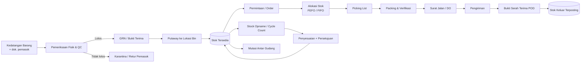
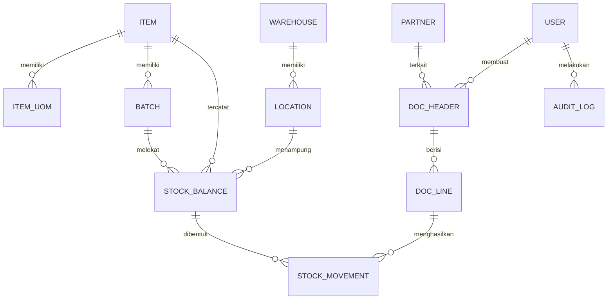

# PRD — Sistem Manajemen Inventori (Penyimpanan & Distribusi Barang)

| Item             | Keterangan                                    |
| ---------------- | --------------------------------------------- |
| Nama Produk      | SIMBAR — Sistem Manajemen Barang (nama kerja) |
| Versi Dokumen    | 0.1 (Draft)                                   |
| Tanggal          | 12 Agustus 2026                               |
| Pemilik Produk   | Dipo — Inventory Manager                      |
| Status           | Untuk direview                                |
| Target Rilis MVP | ± 3 bulan sejak kick-off                      |

---

## 1. Ringkasan Eksekutif

Sistem inventori untuk mencatat dan mengendalikan seluruh pergerakan barang sejak diterima di gudang, disimpan pada lokasi tertentu, sampai didistribusikan ke tujuan. Prinsip utama: **saldo stok tidak pernah diubah langsung** — saldo adalah hasil akumulasi transaksi yang tercatat (perpetual inventory + audit trail), sehingga setiap selisih selalu bisa ditelusuri sampai ke dokumen dan penggunanya.

Lingkup MVP sengaja dibatasi pada operasi gudang inti (inbound → storage → outbound) dengan kaidah yang lazim dipakai pada praktik WMS: pemisahan peran (segregation of duties), penomoran dokumen berurutan, pencatatan lokasi bin, FEFO/FIFO, dan cycle counting berbasis ABC.

---

## 2. Latar Belakang & Permasalahan

Permasalahan yang umum terjadi pada pengelolaan inventori manual/spreadsheet:

| #   | Masalah                                                               | Dampak                                               |
| --- | --------------------------------------------------------------------- | ---------------------------------------------------- |
| P1  | Stok fisik ≠ catatan, selisih baru ketahuan saat stock opname tahunan | Kerugian tidak terdeteksi, keputusan pembelian salah |
| P2  | Tidak ada pencatatan lokasi penyimpanan (rak/bin)                     | Waktu cari barang lama, salah ambil                  |
| P3  | Tidak ada penelusuran batch/nomor seri/kedaluwarsa                    | Barang expired terkirim, recall sulit                |
| P4  | Dokumen serah terima (surat jalan) manual & terpisah dari data stok   | Selisih pengiriman, sengketa dengan penerima         |
| P5  | Tidak ada titik pemesanan ulang (reorder point)                       | Stok habis (stockout) atau menumpuk (overstock)      |
| P6  | Riwayat perubahan data tidak terekam                                  | Tidak ada akuntabilitas, rawan penyalahgunaan        |

---

## 3. Sasaran Produk & Metrik Keberhasilan

| Tujuan                | Metrik (KPI)                             | Baseline               | Target 6 bln setelah go-live |
| --------------------- | ---------------------------------------- | ---------------------- | ---------------------------- |
| Akurasi data stok     | Inventory Record Accuracy (IRA)          | _diisi saat discovery_ | ≥ 98%                        |
| Kecepatan penerimaan  | Waktu rata-rata GRN per kedatangan       | —                      | turun 40%                    |
| Ketepatan distribusi  | Order Fill Rate / OTIF                   | —                      | ≥ 95%                        |
| Ketepatan pengambilan | Picking accuracy                         | —                      | ≥ 99%                        |
| Efisiensi modal kerja | Inventory turnover                       | —                      | naik 15%                     |
| Pengendalian risiko   | Nilai barang kedaluwarsa/rusak per bulan | —                      | turun 50%                    |
| Efisiensi audit       | Durasi stock opname                      | —                      | turun 50%                    |

**Metrik adopsi:** ≥ 90% transaksi gudang dicatat lewat sistem pada bulan ke-2; 0 transaksi stok manual di luar sistem pada bulan ke-3.

---

## 4. Ruang Lingkup

### 4.1 Termasuk (MVP)

1. Master data: barang/SKU, satuan & konversi, kategori, mitra (pemasok/penerima), gudang & lokasi bin.
2. Inbound: penerimaan barang, pemeriksaan/QC, GRN, putaway.
3. Penyimpanan: saldo per lokasi–batch, status stok, penataan lokasi.
4. Outbound: permintaan barang, alokasi, picking, packing, surat jalan, bukti serah terima.
5. Mutasi antar gudang (termasuk status _in-transit_).
6. Penyesuaian stok & stock opname (full + cycle counting).
7. Kartu stok / buku besar pergerakan (stock ledger) yang tidak dapat diubah.
8. Perencanaan sederhana: stok minimum/maksimum, reorder point, notifikasi.
9. Laporan & dashboard operasional.
10. Manajemen pengguna, peran, dan audit log.
11. Dukungan barcode/QR (scan via kamera HP atau scanner USB) dan cetak label.

### 4.2 Tidak Termasuk (fase lanjutan / sistem lain)

- Modul akuntansi lengkap, jurnal GL, e-Faktur/perpajakan.
- Pengadaan penuh (tender, kontrak, evaluasi pemasok).
- Optimasi rute pengiriman & pelacakan GPS armada.
- Peramalan permintaan berbasis ML.
- Otomasi gudang (conveyor, AS/RS, robot).
- Integrasi marketplace/omnichannel.

---

## 5. Pengguna & Peran

| Peran                            | Tugas utama                                                    | Akses kunci                         |
| -------------------------------- | -------------------------------------------------------------- | ----------------------------------- |
| Inventory Manager                | Menyetujui penyesuaian, memantau KPI, mengelola kebijakan stok | Semua modul + persetujuan + laporan |
| Staf Penerimaan                  | Menerima barang, cek fisik, buat GRN, putaway                  | Inbound (buat), lihat stok          |
| Staf Pengeluaran (Picker/Packer) | Picking, packing, cetak surat jalan                            | Outbound (eksekusi)                 |
| Supervisor Gudang                | Verifikasi dokumen, tugaskan pekerjaan, pimpin opname          | Persetujuan level 1, opname         |
| Admin Master Data                | Kelola SKU, mitra, lokasi                                      | Master data (CRUD)                  |
| Pengirim/Kurir                   | Terima tugas kirim, unggah bukti serah terima (POD)            | Surat jalan miliknya saja           |
| Peminta Barang (unit/cabang)     | Ajukan permintaan, pantau status                               | Buat permintaan, lihat status       |
| Auditor / Keuangan               | Baca laporan & jejak audit                                     | Read-only                           |
| Administrator Sistem             | Kelola pengguna, peran, konfigurasi                            | Administrasi                        |

**Prinsip:** pemisahan tugas — pembuat dokumen tidak boleh menjadi penyetuju dokumen yang sama (maker–checker).

---

## 6. Alur Proses Bisnis

### 6.1 Alur Utama

### 6.2 Rincian Proses

**A. Penerimaan (Inbound)**

1. Barang datang dengan dokumen pemasok (PO/surat jalan pemasok).
2. Staf memverifikasi jumlah, kondisi, batch, tanggal kedaluwarsa terhadap referensi PO.
3. Barang lolos → status _Available_; barang bermasalah → status _Quarantine_ atau _Damaged_ dengan berita acara.
4. GRN terbit otomatis dengan nomor unik; stok bertambah pada lokasi _staging_.
5. Putaway: sistem menyarankan lokasi bin (berdasarkan kategori, kelas ABC, kapasitas), staf mengonfirmasi dengan scan bin.

**B. Penyimpanan (Storage)**

- Hierarki lokasi: `Gudang → Zona → Rak → Level → Bin`.
- Penempatan berbasis kecepatan perputaran (fast moving dekat area pengeluaran).
- Barang ber-kedaluwarsa disimpan dengan info batch; sistem memberi peringatan pada ambang H-90/H-30.
- Cycle counting terjadwal: kelas A dihitung bulanan, B triwulanan, C semesteran.

**C. Distribusi (Outbound)**

1. Permintaan diajukan unit/pelanggan → disetujui.
2. Sistem mengalokasikan (reserve) stok sesuai aturan FEFO/FIFO; stok _available_ berkurang, _on-hand_ belum.
3. Picking list terbit per rute bin (urut lokasi untuk meminimalkan jarak jalan).
4. Packing + verifikasi scan; ketidaksesuaian harus diselesaikan sebelum lanjut.
5. Surat jalan terbit (nomor unik, daftar barang, tujuan, kendaraan/kurir).
6. Barang keluar → stok on-hand berkurang, kartu stok terisi.
7. Penerima menandatangani/mengunggah POD; dokumen berstatus _Completed_.

**D. Mutasi Antar Gudang**
Transfer Out (stok gudang asal berkurang → status _In-Transit_) → Transfer In (dikonfirmasi gudang tujuan). Selisih transit wajib diinvestigasi.

**E. Retur**

- Retur dari penerima → masuk sebagai inbound dengan referensi surat jalan asal, wajib inspeksi.
- Retur ke pemasok → outbound dengan referensi GRN asal.

**F. Penyesuaian (Adjustment)**
Hanya melalui dokumen penyesuaian bertipe alasan (selisih opname, rusak, hilang, kedaluwarsa, koreksi satuan) + persetujuan sesuai ambang nilai.

### 6.3 Status Dokumen & Status Stok

- **Status dokumen:** `Draft → Diajukan → Disetujui → Diproses → Selesai` (+ `Dibatalkan`, dengan alasan wajib; dokumen selesai tidak dapat dihapus, hanya dikoreksi lewat dokumen pembalik).
- **Status stok:** `Available`, `Reserved`, `Quarantine`, `Damaged`, `In-Transit`, `Expired`.

---

## 7. Kebutuhan Fungsional

Prioritas: **M** = Must (MVP), **S** = Should, **C** = Could.

### M1 — Master Data

| ID     | Kebutuhan                                                                                                                                                      | Prioritas |
| ------ | -------------------------------------------------------------------------------------------------------------------------------------------------------------- | --------- |
| FR-1.1 | CRUD barang: kode SKU unik, nama, kategori, satuan dasar, satuan alternatif + faktor konversi, barcode, min/max stok, kelas ABC, flag batch/serial/kedaluwarsa | M         |
| FR-1.2 | CRUD gudang & lokasi bin berhierarki, dengan kode lokasi unik & barcode lokasi                                                                                 | M         |
| FR-1.3 | CRUD mitra (pemasok, penerima/unit tujuan) beserta alamat kirim                                                                                                | M         |
| FR-1.4 | Impor massal master data dari CSV/Excel dengan validasi & laporan baris gagal                                                                                  | M         |
| FR-1.5 | Penonaktifan (soft delete) master data yang pernah bertransaksi — tidak boleh dihapus permanen                                                                 | M         |
| FR-1.6 | Cetak label barcode/QR untuk SKU dan lokasi (printer thermal)                                                                                                  | S         |

### M2 — Penerimaan Barang

| ID     | Kebutuhan                                                                      | Prioritas |
| ------ | ------------------------------------------------------------------------------ | --------- |
| FR-2.1 | Buat dokumen penerimaan dengan/atau tanpa referensi PO                         | M         |
| FR-2.2 | Input per baris: SKU, qty, satuan, batch, tgl kedaluwarsa, kondisi             | M         |
| FR-2.3 | Deteksi selisih terhadap PO (over/under receipt) dengan toleransi konfigurabel | M         |
| FR-2.4 | Penetapan status QC (lolos/karantina/tolak) per baris                          | M         |
| FR-2.5 | Putaway dengan saran lokasi + konfirmasi scan bin                              | M         |
| FR-2.6 | Unggah lampiran (foto barang, surat jalan pemasok)                             | S         |

### M3 — Penyimpanan & Saldo

| ID     | Kebutuhan                                                                   | Prioritas |
| ------ | --------------------------------------------------------------------------- | --------- |
| FR-3.1 | Tampilan saldo stok per SKU per gudang per bin per batch, real-time         | M         |
| FR-3.2 | Pencarian & filter stok (SKU, kategori, lokasi, batch, status, kedaluwarsa) | M         |
| FR-3.3 | Pemindahan internal antar bin dalam gudang yang sama                        | M         |
| FR-3.4 | Peringatan kedaluwarsa & stok di bawah minimum                              | M         |
| FR-3.5 | Perhitungan kelas ABC otomatis berdasarkan nilai/frekuensi keluar           | C         |

### M4 — Distribusi / Pengeluaran

| ID     | Kebutuhan                                                                                | Prioritas |
| ------ | ---------------------------------------------------------------------------------------- | --------- |
| FR-4.1 | Pengajuan permintaan barang oleh unit/pelanggan + alur persetujuan                       | M         |
| FR-4.2 | Alokasi stok otomatis sesuai FEFO (default untuk barang kedaluwarsa) / FIFO              | M         |
| FR-4.3 | Cetak picking list terurut lokasi bin                                                    | M         |
| FR-4.4 | Konfirmasi picking via scan (SKU + bin), blokir jika tidak cocok                         | M         |
| FR-4.5 | Packing & pembuatan surat jalan bernomor unik (PDF siap cetak, minimal 3 rangkap)        | M         |
| FR-4.6 | Pencatatan penerimaan barang oleh penerima (POD): nama, waktu, tanda tangan digital/foto | M         |
| FR-4.7 | Pengiriman parsial & pencatatan sisa outstanding                                         | S         |
| FR-4.8 | Notifikasi status ke peminta (email/WhatsApp)                                            | S         |

### M5 — Mutasi Antar Gudang

| ID     | Kebutuhan                                                                            | Prioritas |
| ------ | ------------------------------------------------------------------------------------ | --------- |
| FR-5.1 | Dokumen transfer dengan status in-transit dan konfirmasi penerimaan di gudang tujuan | M         |
| FR-5.2 | Laporan selisih transit (dikirim vs diterima)                                        | M         |

### M6 — Opname & Penyesuaian

| ID     | Kebutuhan                                                                      | Prioritas |
| ------ | ------------------------------------------------------------------------------ | --------- |
| FR-6.1 | Sesi opname: penuh, per zona, atau cycle count berbasis kelas ABC              | M         |
| FR-6.2 | Lembar hitung buta (blind count — jumlah sistem disembunyikan dari penghitung) | M         |
| FR-6.3 | Perhitungan selisih otomatis + input alasan per baris                          | M         |
| FR-6.4 | Persetujuan berjenjang berdasarkan ambang nilai selisih                        | M         |
| FR-6.5 | Posting penyesuaian menghasilkan entri kartu stok bertipe ADJ                  | M         |
| FR-6.6 | Laporan akurasi inventori (IRA) per periode & per zona                         | S         |

### M7 — Kartu Stok & Jejak Audit

| ID     | Kebutuhan                                                                           | Prioritas |
| ------ | ----------------------------------------------------------------------------------- | --------- |
| FR-7.1 | Kartu stok per SKU: tanggal, tipe transaksi, dokumen, masuk, keluar, saldo berjalan | M         |
| FR-7.2 | Entri kartu stok bersifat append-only — tidak dapat diedit/dihapus                  | M         |
| FR-7.3 | Audit log seluruh aksi pengguna (siapa, kapan, dari mana, nilai lama → baru)        | M         |
| FR-7.4 | Penelusuran batch: dari batch ke semua penerima (forward) dan ke pemasok (backward) | S         |

### M8 — Perencanaan Persediaan

| ID     | Kebutuhan                                                                                  | Prioritas |
| ------ | ------------------------------------------------------------------------------------------ | --------- |
| FR-8.1 | Konfigurasi stok minimum, maksimum, safety stock, lead time per SKU                        | M         |
| FR-8.2 | Perhitungan reorder point: `ROP = (rata-rata pemakaian harian × lead time) + safety stock` | M         |
| FR-8.3 | Daftar usulan pembelian (barang di bawah ROP) yang dapat diekspor                          | S         |
| FR-8.4 | Laporan slow moving & dead stock (tanpa pergerakan > N hari)                               | S         |

### M9 — Laporan & Dashboard

| ID     | Kebutuhan                                                                                                                      | Prioritas |
| ------ | ------------------------------------------------------------------------------------------------------------------------------ | --------- |
| FR-9.1 | Dashboard: nilai & jumlah stok, transaksi hari ini, item di bawah minimum, mendekati kedaluwarsa, dokumen menunggu persetujuan | M         |
| FR-9.2 | Laporan mutasi stok per periode (saldo awal, masuk, keluar, penyesuaian, saldo akhir)                                          | M         |
| FR-9.3 | Laporan aging & kedaluwarsa                                                                                                    | M         |
| FR-9.4 | Laporan kinerja pengiriman (OTIF, lead time) & kinerja pemasok                                                                 | S         |
| FR-9.5 | Ekspor seluruh laporan ke Excel/CSV/PDF                                                                                        | M         |

### M10 — Administrasi

| ID      | Kebutuhan                                                            | Prioritas |
| ------- | -------------------------------------------------------------------- | --------- |
| FR-10.1 | Manajemen pengguna & peran berbasis RBAC (izin per modul & per aksi) | M         |
| FR-10.2 | Pembatasan akses berdasarkan gudang yang ditugaskan                  | M         |
| FR-10.3 | Konfigurasi format penomoran dokumen (prefix, reset periodik)        | M         |
| FR-10.4 | Konfigurasi alur & ambang persetujuan                                | S         |

### Contoh Kriteria Penerimaan (format Given–When–Then)

**FR-4.2 — Alokasi FEFO**

- _Given_ SKU X memiliki batch A (exp 2026-09-30, qty 50) dan batch B (exp 2026-12-31, qty 100),
- _When_ pengguna membuat pengeluaran 70 unit,
- _Then_ sistem mengalokasikan 50 dari batch A dan 20 dari batch B, serta menampilkan rincian batch pada picking list.

**FR-7.2 — Kartu stok append-only**

- _Given_ entri kartu stok sudah terposting,
- _When_ pengguna mana pun (termasuk admin) mencoba mengubah/menghapusnya,
- _Then_ sistem menolak dan hanya menawarkan pembuatan dokumen koreksi/pembalik yang tercatat sebagai entri baru.

---

## 8. Aturan Bisnis

| ID    | Aturan                                                                                                                       |
| ----- | ---------------------------------------------------------------------------------------------------------------------------- |
| BR-01 | Saldo stok hanya berubah melalui dokumen transaksi bertipe GRN, DO, TRF, ADJ, atau RTN. Tidak ada pengeditan saldo langsung. |
| BR-02 | Stok tidak boleh negatif. Transaksi yang menyebabkan saldo negatif ditolak.                                                  |
| BR-03 | FEFO wajib untuk barang ber-tanggal kedaluwarsa; FIFO untuk lainnya. Penyimpangan (override) harus beralasan dan tercatat.   |
| BR-04 | Nomor dokumen dibuat otomatis, unik, berurutan, dan tidak dapat digunakan ulang.                                             |
| BR-05 | Pembuat dokumen tidak boleh menyetujui dokumennya sendiri (maker–checker).                                                   |
| BR-06 | Stok berstatus _Quarantine_ atau _Damaged_ tidak ikut dihitung sebagai stok tersedia untuk dialokasikan.                     |
| BR-07 | Alokasi mengurangi stok _available_ dan menambah _reserved_; _on-hand_ baru berkurang saat barang benar-benar keluar.        |
| BR-08 | Semua saldo disimpan dalam satuan dasar; konversi satuan harus terdefinisi di master data.                                   |
| BR-09 | Metode penilaian persediaan konsisten (FIFO atau rata-rata tertimbang) sesuai PSAK 14; LIFO tidak digunakan.                 |
| BR-10 | Dokumen berstatus _Selesai_ tidak dapat dibatalkan; koreksi dilakukan lewat dokumen pembalik.                                |
| BR-11 | Setiap barang harus berada pada tepat satu bin; perpindahan wajib melalui transaksi pemindahan.                              |

---

## 9. Model Data (Konseptual)

**Entitas inti & atribut kunci**

| Entitas                                   | Atribut penting                                                                                                            |
| ----------------------------------------- | -------------------------------------------------------------------------------------------------------------------------- |
| `item`                                    | sku, nama, kategori, uom_dasar, is_batch, is_expiry, min_qty, max_qty, lead_time, kelas_abc, status                        |
| `item_uom`                                | item_id, uom, faktor_konversi, barcode                                                                                     |
| `warehouse`                               | kode, nama, alamat, pj_gudang                                                                                              |
| `location`                                | warehouse_id, kode_bin, zona, rak, level, kapasitas, tipe (staging/pick/bulk/quarantine)                                   |
| `batch`                                   | item_id, no_batch, tgl_produksi, tgl_kedaluwarsa, no_seri                                                                  |
| `stock_balance`                           | item_id, location_id, batch_id, qty_onhand, qty_reserved, status                                                           |
| `stock_movement`                          | tanggal, item_id, location_id, batch_id, tipe (IN/OUT/TRF/ADJ), qty, saldo_setelah, doc_line_id, user_id — **append only** |
| `doc_header`                              | no_dokumen, tipe (GRN/DO/TRF/ADJ/RTN/CNT), tanggal, partner_id, warehouse_id, status, dibuat_oleh, disetujui_oleh          |
| `doc_line`                                | doc_id, item_id, qty_diminta, qty_diproses, uom, batch_id, catatan                                                         |
| `count_session`                           | tipe, cakupan, tanggal, status, petugas                                                                                    |
| `partner`                                 | tipe (supplier/customer/unit), kode, nama, alamat, kontak                                                                  |
| `user`, `role`, `permission`, `audit_log` | standar RBAC + jejak audit                                                                                                 |

---

## 10. Kebutuhan Non-Fungsional

| Kategori      | Kebutuhan                                                                                                                                                                                                                                       |
| ------------- | ----------------------------------------------------------------------------------------------------------------------------------------------------------------------------------------------------------------------------------------------- |
| Kinerja       | Halaman utama & pencarian stok < 2 detik untuk 100.000 SKU; posting dokumen < 3 detik; mendukung 50 pengguna bersamaan (skalabel ke 200)                                                                                                        |
| Ketersediaan  | Uptime ≥ 99,5% jam kerja; RPO ≤ 24 jam, RTO ≤ 4 jam; backup harian otomatis + uji restore triwulanan                                                                                                                                            |
| Keamanan      | RBAC per aksi; kata sandi terenkripsi (hash + salt); TLS 1.2+; enkripsi data sensitif saat disimpan; session timeout; proteksi OWASP Top 10; 2FA untuk peran admin/manager                                                                      |
| Auditabilitas | Seluruh transaksi & perubahan master data terekam (aktor, waktu, nilai sebelum–sesudah), log tidak dapat dihapus                                                                                                                                |
| Kegunaan      | Antarmuka Bahasa Indonesia; mobile-first untuk staf gudang (layar 5–7"); operasi utama dapat diselesaikan dengan scan; tombol besar & kontras tinggi (dipakai sambil berdiri/bergerak)                                                          |
| Ketahanan     | Draft transaksi tersimpan lokal saat koneksi terputus, disinkron ketika daring kembali                                                                                                                                                          |
| Perangkat     | Kompatibel scanner USB/Bluetooth & printer thermal (label 50×30 mm, surat jalan A5/A4)                                                                                                                                                          |
| Pemeliharaan  | Kode terdokumentasi, API terdokumentasi (OpenAPI), lingkungan dev/staging/production terpisah                                                                                                                                                   |
| Kepatuhan     | Pengendalian rekaman mengacu ISO 9001:2015 klausul 7.5; penomoran/barcode mengacu standar GS1 (GTIN/SSCC) bila diperlukan; data pribadi (kurir, penerima) mengikuti UU No. 27/2022 tentang PDP; jika barang farmasi/pangan, tambahan CDOB/HACCP |

---

## 11. Integrasi (Fase Lanjutan)

| Sistem                      | Arah     | Data                                              |
| --------------------------- | -------- | ------------------------------------------------- |
| Akuntansi/ERP               | Keluar   | Nilai persediaan, jurnal penerimaan & pengeluaran |
| Pengadaan                   | Masuk    | Data PO sebagai referensi penerimaan              |
| Notifikasi (email/WhatsApp) | Keluar   | Status permintaan, peringatan stok minimum        |
| Perangkat scanner/printer   | Dua arah | Barcode & label                                   |
| API publik (REST)           | Dua arah | Query stok, buat permintaan dari sistem lain      |

---

## 12. Rencana Rilis

| Fase               | Durasi      | Isi                                                                      | Kriteria selesai                       |
| ------------------ | ----------- | ------------------------------------------------------------------------ | -------------------------------------- |
| Fase 0 — Discovery | 2 minggu    | Pemetaan proses saat ini, pendataan SKU & lokasi, penetapan baseline KPI | Daftar SKU & peta gudang final         |
| Fase 1 — MVP       | 8–10 minggu | M1, M2, M3, M4, M6 (opname dasar), M7, M10                               | Satu gudang beroperasi penuh di sistem |
| Fase 2             | 4–6 minggu  | M5 (mutasi), M8 (ROP), M9 lanjutan, barcode & label, POD digital         | Multi-gudang, laporan manajerial aktif |
| Fase 3             | 6 minggu    | Integrasi ERP, penelusuran batch penuh, mode offline, API publik         | Integrasi berjalan di produksi         |

**Strategi migrasi:** cut-off stok awal lewat opname penuh → impor saldo awal sebagai dokumen `OPENING` → paralel run 2 minggu (sistem + catatan lama) → penghentian pencatatan manual.

---

## 13. Risiko & Mitigasi

| Risiko                                                | Dampak | Mitigasi                                                                                    |
| ----------------------------------------------------- | ------ | ------------------------------------------------------------------------------------------- |
| Master data kotor (SKU ganda, satuan tidak konsisten) | Tinggi | Pembersihan data di Fase 0, validasi impor, satu penanggung jawab master data               |
| Staf gudang enggan memakai sistem                     | Tinggi | Desain berbasis scan (minim ketik), pelatihan langsung di lapangan, dukungan minggu pertama |
| Saldo awal tidak akurat                               | Tinggi | Opname penuh sebelum go-live + verifikasi silang oleh supervisor                            |
| Koneksi internet gudang tidak stabil                  | Sedang | Mode draft offline, sinkronisasi otomatis                                                   |
| Ruang lingkup melebar                                 | Sedang | Kunci daftar Must-have MVP; permintaan baru masuk backlog fase berikutnya                   |

---

## 14. Asumsi & Pertanyaan Terbuka

**Asumsi yang dipakai dalam dokumen ini**

1. Jumlah gudang awal 1–3, jumlah SKU < 10.000, transaksi < 500 baris/hari.
2. Barang bersifat umum (bukan farmasi/B3 yang menuntut sertifikasi khusus) — jika berbeda, aturan CDOB/B3 perlu ditambahkan.
3. Aplikasi berbasis web responsif (dapat diakses via HP), bukan aplikasi native terpisah.
4. Penilaian persediaan mengikuti metode rata-rata tertimbang.
5. Belum ada ERP eksisting yang wajib diintegrasikan pada MVP.

**Perlu dikonfirmasi**

- Jenis barang & apakah ada kebutuhan batch/nomor seri/kedaluwarsa?
- Jumlah gudang, pengguna, dan volume transaksi harian?
- Distribusi ke pelanggan eksternal atau ke unit internal?
- Perlukah nilai/harga persediaan ditampilkan, atau cukup kuantitas?
- Apakah sudah ada sistem pembelian/akuntansi yang harus disambungkan?

---

## 15. Glosarium

| Istilah          | Arti                                                                |
| ---------------- | ------------------------------------------------------------------- |
| GRN              | _Goods Receipt Note_ — bukti penerimaan barang                      |
| DO / Surat Jalan | _Delivery Order_ — dokumen pengeluaran & pengiriman barang          |
| POD              | _Proof of Delivery_ — bukti serah terima di penerima                |
| Putaway          | Proses menempatkan barang yang sudah diterima ke lokasi simpan      |
| Picking          | Pengambilan barang dari lokasi simpan sesuai daftar                 |
| FIFO / FEFO      | Keluar berdasarkan yang masuk lebih dulu / kedaluwarsa lebih dulu   |
| ROP              | _Reorder Point_ — titik saldo yang memicu pemesanan ulang           |
| Cycle Count      | Perhitungan fisik sebagian secara berkala, bukan sekali setahun     |
| IRA              | _Inventory Record Accuracy_ — persentase kecocokan catatan vs fisik |
| OTIF             | _On Time In Full_ — pengiriman tepat waktu dan lengkap              |
| Bin              | Unit lokasi penyimpanan terkecil yang punya kode unik               |
