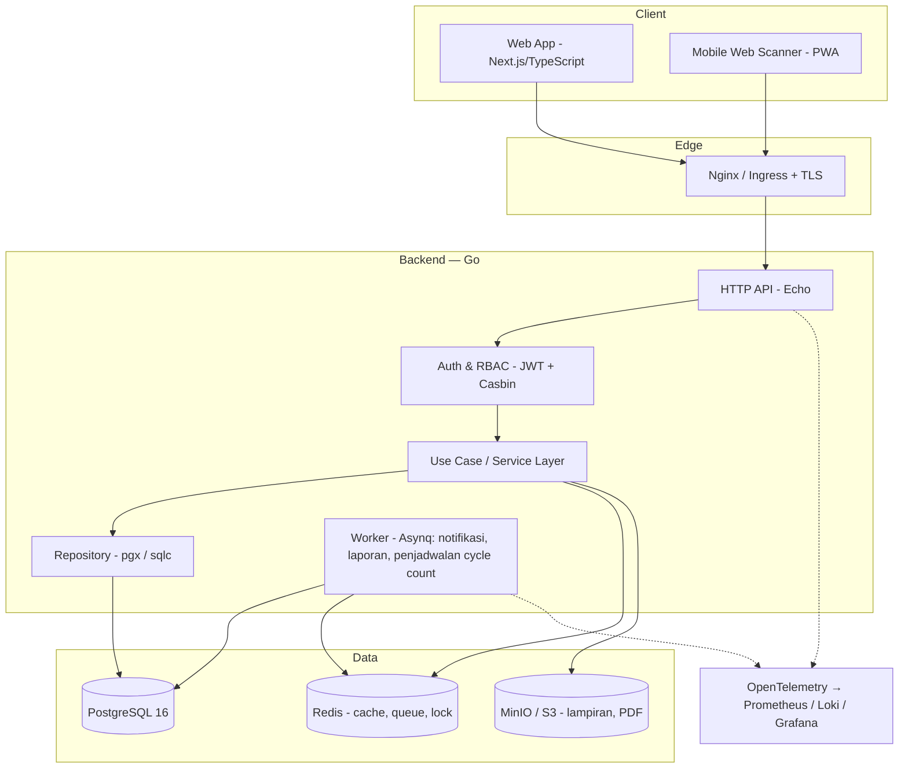
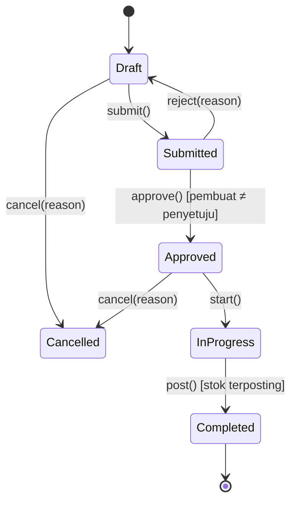

# FSD — Sistem Manajemen Inventori (SIMBAR)
## Functional Specification Document

| Item | Keterangan |
|---|---|
| Dokumen Induk | PRD — Sistem Manajemen Inventori v0.1 |
| Versi | 0.1 (Draft) |
| Tanggal | 12 Agustus 2026 |
| Pemilik | Dipo — Inventory Manager |
| Audiens | Tech Lead, Backend/Frontend Engineer, DBA, QA, DevOps |
| Stack | Go (backend) · PostgreSQL (database) · React/Next.js + TypeScript (frontend) |

---

## 1. Pendahuluan

### 1.1 Tujuan
Menerjemahkan kebutuhan fungsional pada PRD menjadi spesifikasi teknis yang dapat langsung dieksekusi tim pengembang: arsitektur, skema basis data, kontrak API, algoritma inti, aturan validasi, dan perilaku sistem pada kondisi normal maupun gagal.

### 1.2 Prinsip Desain
1. **Ledger sebagai sumber kebenaran.** `stock_movements` bersifat *append-only*; `stock_balances` adalah materialized state yang selalu dapat direkonstruksi ulang dari ledger.
2. **Konsistensi kuat pada transaksi stok.** Semua posting stok dalam satu transaksi database dengan penguncian baris berurutan.
3. **Idempoten.** Setiap operasi posting menerima `Idempotency-Key` agar retry jaringan tidak menggandakan stok.
4. **Modular monolith dulu, bukan microservice.** Batas modul tegas di level package Go; pemecahan layanan hanya jika terbukti perlu.
5. **API-first.** Kontrak OpenAPI 3.1 disepakati sebelum implementasi; frontend & backend berjalan paralel dari kontrak yang sama.

---

## 2. Arsitektur Sistem

### 2.1 Diagram Lapisan



### 2.2 Technology Stack

**Backend (Go 1.23+)**

| Komponen | Pilihan | Alasan |
|---|---|---|
| HTTP framework | `labstack/echo/v4` | Ringan, middleware matang, stabil untuk API enterprise |
| DB driver | `jackc/pgx/v5` (pool) | Native Postgres, performa & tipe data terbaik |
| Query layer | `sqlc` (generate dari SQL) | Type-safe, SQL eksplisit — penting untuk logika stok |
| Migrasi | `golang-migrate` | Versi skema terkontrol, up/down |
| Validasi | `go-playground/validator/v10` | Deklaratif pada DTO |
| Autentikasi | JWT (`golang-jwt/v5`) access 15 mnt + refresh token 7 hari (rotating) | Stateless, mudah di-scale |
| Otorisasi | `casbin/v2` model RBAC + domain (gudang) | Izin per aksi & per gudang tanpa hardcode |
| Background job | `hibiken/asynq` (Redis) | Retry, scheduler cron, dashboard |
| Logging | `log/slog` (JSON) + korelasi `request_id` | Standar pustaka, mudah diagregasi |
| Tracing/Metrics | OpenTelemetry SDK | Observability standar |
| API doc | OpenAPI 3.1 + `oapi-codegen` | Kontrak jadi sumber tunggal |
| PDF/Label | `chromedp` (HTML→PDF) atau `maroto` | Surat jalan & label barcode |
| Testing | `testify` + `testcontainers-go` | Uji integrasi dengan Postgres asli |

**Frontend**

| Komponen | Pilihan |
|---|---|
| Framework | Next.js 15 (App Router) + React 19, TypeScript strict |
| UI Library | Ant Design 5 (tabel, form, dan komponen data-heavy yang matang; tema dapat dikustom) |
| Data fetching | TanStack Query v5 (cache, retry, optimistic update) |
| Form & validasi | React Hook Form + Zod (skema Zod digenerate dari OpenAPI) |
| State global | Zustand (sesi, gudang aktif, keranjang scan) |
| Tabel besar | AntD Table + virtual scroll / TanStack Virtual |
| Grafik | Recharts |
| Scanner | `@zxing/browser` (kamera) + input keyboard-wedge untuk scanner USB |
| PWA/offline | Service Worker + IndexedDB (`dexie`) untuk draft transaksi |
| Testing | Vitest + Testing Library + Playwright (E2E) |

**Infrastruktur**
- Container Docker, orkestrasi Kubernetes (atau Docker Compose untuk skala awal).
- Lingkungan: `dev` → `staging` → `production`, konfigurasi via environment variable (12-factor).
- CI/CD: lint (`golangci-lint`, ESLint) → unit test → integration test → build image → deploy.
- Backup: `pg_basebackup` + WAL archiving (PITR), uji restore triwulanan.

### 2.3 Struktur Proyek Backend

```
cmd/
  api/main.go              # entrypoint HTTP
  worker/main.go           # entrypoint background job
internal/
  config/                  # env loader
  domain/                  # entity + interface repository (tanpa dependensi luar)
    item/ stock/ document/ user/
  usecase/                 # orkestrasi bisnis, transaksi, aturan
    inbound/ outbound/ transfer/ counting/ planning/
  repository/postgres/     # implementasi repo, hasil sqlc
  delivery/http/
    handler/ dto/ middleware/ router.go
  pkg/
    apperr/ logger/ pagination/ docnum/ idempotency/
db/
  migrations/              # 000001_init.up.sql ...
  queries/                 # sumber sqlc
api/openapi.yaml
```

Aturan dependensi: `delivery → usecase → domain ← repository`. Domain tidak mengimpor apa pun dari lapisan luar.

---

## 3. Skema Basis Data (PostgreSQL 16)

Skema dipisah per domain: `master`, `inv`, `doc`, `sec`, `aud`.

### 3.1 Konvensi
- Primary key `BIGINT GENERATED ALWAYS AS IDENTITY`; entitas yang diekspos ke luar juga punya kolom `public_id UUID`.
- Kuantitas: `NUMERIC(18,4)` — **tidak pernah** `float`.
- Waktu: `TIMESTAMPTZ`, disimpan UTC, ditampilkan `Asia/Jakarta`.
- Audit kolom: `created_at`, `created_by`, `updated_at`, `updated_by`.
- Soft delete: `is_active BOOLEAN` (master data), bukan `DELETE`.
- Penamaan: `snake_case`, tabel jamak, index `idx_<tabel>_<kolom>`.

### 3.2 DDL Inti

```sql
-- ============ MASTER ============
CREATE TABLE master.items (
    id            BIGINT GENERATED ALWAYS AS IDENTITY PRIMARY KEY,
    public_id     UUID NOT NULL DEFAULT gen_random_uuid() UNIQUE,
    sku           VARCHAR(50)  NOT NULL UNIQUE,
    name          VARCHAR(255) NOT NULL,
    category_id   BIGINT REFERENCES master.categories(id),
    base_uom      VARCHAR(20)  NOT NULL,
    is_batch      BOOLEAN NOT NULL DEFAULT FALSE,
    is_expiry     BOOLEAN NOT NULL DEFAULT FALSE,
    is_serial     BOOLEAN NOT NULL DEFAULT FALSE,
    min_qty       NUMERIC(18,4) NOT NULL DEFAULT 0 CHECK (min_qty >= 0),
    max_qty       NUMERIC(18,4),
    safety_stock  NUMERIC(18,4) NOT NULL DEFAULT 0,
    lead_time_days SMALLINT NOT NULL DEFAULT 0,
    abc_class     CHAR(1) CHECK (abc_class IN ('A','B','C')),
    is_active     BOOLEAN NOT NULL DEFAULT TRUE,
    created_at    TIMESTAMPTZ NOT NULL DEFAULT now(),
    created_by    BIGINT NOT NULL,
    updated_at    TIMESTAMPTZ,
    updated_by    BIGINT,
    CONSTRAINT chk_expiry_needs_batch CHECK (NOT is_expiry OR is_batch),
    CONSTRAINT chk_max_gte_min CHECK (max_qty IS NULL OR max_qty >= min_qty)
);
CREATE INDEX idx_items_name_trgm ON master.items USING gin (name gin_trgm_ops);

CREATE TABLE master.item_uoms (
    id            BIGINT GENERATED ALWAYS AS IDENTITY PRIMARY KEY,
    item_id       BIGINT NOT NULL REFERENCES master.items(id),
    uom           VARCHAR(20) NOT NULL,
    conv_factor   NUMERIC(18,6) NOT NULL CHECK (conv_factor > 0), -- ke base_uom
    barcode       VARCHAR(64),
    UNIQUE (item_id, uom),
    UNIQUE (barcode)
);

CREATE TABLE master.warehouses (
    id        BIGINT GENERATED ALWAYS AS IDENTITY PRIMARY KEY,
    code      VARCHAR(20) NOT NULL UNIQUE,
    name      VARCHAR(150) NOT NULL,
    address   TEXT,
    is_active BOOLEAN NOT NULL DEFAULT TRUE
);

CREATE TYPE inv.location_type AS ENUM ('staging','pick','bulk','quarantine','damaged','transit');

CREATE TABLE master.locations (
    id           BIGINT GENERATED ALWAYS AS IDENTITY PRIMARY KEY,
    warehouse_id BIGINT NOT NULL REFERENCES master.warehouses(id),
    code         VARCHAR(30) NOT NULL,          -- contoh: A-01-03-B
    zone         VARCHAR(20),
    rack         VARCHAR(20),
    level        VARCHAR(20),
    loc_type     inv.location_type NOT NULL DEFAULT 'bulk',
    pick_seq     INTEGER,                       -- urutan jalur picking
    capacity     NUMERIC(18,4),
    is_active    BOOLEAN NOT NULL DEFAULT TRUE,
    UNIQUE (warehouse_id, code)
);

CREATE TABLE master.batches (
    id          BIGINT GENERATED ALWAYS AS IDENTITY PRIMARY KEY,
    item_id     BIGINT NOT NULL REFERENCES master.items(id),
    batch_no    VARCHAR(60) NOT NULL,
    mfg_date    DATE,
    expiry_date DATE,
    UNIQUE (item_id, batch_no)
);
CREATE INDEX idx_batches_expiry ON master.batches (item_id, expiry_date);

CREATE TABLE master.partners (
    id           BIGINT GENERATED ALWAYS AS IDENTITY PRIMARY KEY,
    code         VARCHAR(30) NOT NULL UNIQUE,
    partner_type VARCHAR(20) NOT NULL CHECK (partner_type IN ('supplier','customer','internal_unit')),
    name         VARCHAR(200) NOT NULL,
    address      TEXT,
    contact_name VARCHAR(100),
    contact_phone VARCHAR(30),
    is_active    BOOLEAN NOT NULL DEFAULT TRUE
);

-- ============ INVENTORY ============
CREATE TYPE inv.stock_status AS ENUM ('available','quarantine','damaged','expired','in_transit');

CREATE TABLE inv.stock_balances (
    id           BIGINT GENERATED ALWAYS AS IDENTITY PRIMARY KEY,
    item_id      BIGINT NOT NULL REFERENCES master.items(id),
    location_id  BIGINT NOT NULL REFERENCES master.locations(id),
    batch_id     BIGINT REFERENCES master.batches(id),
    status       inv.stock_status NOT NULL DEFAULT 'available',
    qty_onhand   NUMERIC(18,4) NOT NULL DEFAULT 0,
    qty_reserved NUMERIC(18,4) NOT NULL DEFAULT 0,
    updated_at   TIMESTAMPTZ NOT NULL DEFAULT now(),
    CONSTRAINT chk_onhand_nonneg   CHECK (qty_onhand >= 0),                 -- BR-02
    CONSTRAINT chk_reserved_valid  CHECK (qty_reserved >= 0 AND qty_reserved <= qty_onhand) -- BR-07
);
-- kunci unik yang memperlakukan batch NULL sebagai satu baris
CREATE UNIQUE INDEX uq_balance_key
  ON inv.stock_balances (item_id, location_id, COALESCE(batch_id, 0), status);
CREATE INDEX idx_balance_item_status ON inv.stock_balances (item_id, status)
  WHERE qty_onhand > 0;

CREATE TYPE inv.movement_type AS ENUM
  ('receipt','issue','transfer_out','transfer_in','adjustment','putaway','internal_move','return_in','return_out','opening');

CREATE TABLE inv.stock_movements (
    id            BIGINT GENERATED ALWAYS AS IDENTITY,
    moved_at      TIMESTAMPTZ NOT NULL DEFAULT now(),
    item_id       BIGINT NOT NULL REFERENCES master.items(id),
    location_id   BIGINT NOT NULL REFERENCES master.locations(id),
    batch_id      BIGINT REFERENCES master.batches(id),
    status        inv.stock_status NOT NULL,
    movement_type inv.movement_type NOT NULL,
    qty           NUMERIC(18,4) NOT NULL CHECK (qty <> 0),  -- (+) masuk, (−) keluar
    qty_after     NUMERIC(18,4) NOT NULL,                   -- saldo lokasi-batch setelah gerakan
    unit_cost     NUMERIC(18,4),
    doc_line_id   BIGINT NOT NULL REFERENCES doc.document_lines(id),
    doc_no        VARCHAR(40) NOT NULL,
    created_by    BIGINT NOT NULL,
    PRIMARY KEY (id, moved_at)
) PARTITION BY RANGE (moved_at);
-- partisi bulanan dibuat otomatis oleh job (pg_partman opsional)
CREATE INDEX idx_mov_item_time ON inv.stock_movements (item_id, moved_at DESC);
CREATE INDEX idx_mov_doc ON inv.stock_movements (doc_line_id);

-- Ledger tidak boleh diubah (BR-01, FR-7.2)
CREATE RULE no_update_movements AS ON UPDATE TO inv.stock_movements DO INSTEAD NOTHING;
CREATE RULE no_delete_movements AS ON DELETE TO inv.stock_movements DO INSTEAD NOTHING;
REVOKE UPDATE, DELETE ON inv.stock_movements FROM app_user;

-- ============ DOCUMENT ============
CREATE TYPE doc.doc_type   AS ENUM ('GRN','DO','TRF','ADJ','RTN_IN','RTN_OUT','CNT','OPN','REQ');
CREATE TYPE doc.doc_status AS ENUM ('draft','submitted','approved','in_progress','completed','cancelled');

CREATE TABLE doc.documents (
    id             BIGINT GENERATED ALWAYS AS IDENTITY PRIMARY KEY,
    public_id      UUID NOT NULL DEFAULT gen_random_uuid() UNIQUE,
    doc_no         VARCHAR(40) NOT NULL UNIQUE,          -- BR-04
    doc_type       doc.doc_type NOT NULL,
    doc_date       DATE NOT NULL,
    status         doc.doc_status NOT NULL DEFAULT 'draft',
    warehouse_id   BIGINT NOT NULL REFERENCES master.warehouses(id),
    dest_warehouse_id BIGINT REFERENCES master.warehouses(id), -- untuk TRF
    partner_id     BIGINT REFERENCES master.partners(id),
    ref_doc_id     BIGINT REFERENCES doc.documents(id),   -- retur/koreksi menunjuk dokumen asal
    reason_code    VARCHAR(30),                           -- wajib untuk ADJ & cancel
    notes          TEXT,
    idempotency_key VARCHAR(80) UNIQUE,
    created_at     TIMESTAMPTZ NOT NULL DEFAULT now(),
    created_by     BIGINT NOT NULL,
    submitted_at   TIMESTAMPTZ,
    approved_at    TIMESTAMPTZ,
    approved_by    BIGINT,
    completed_at   TIMESTAMPTZ,
    CONSTRAINT chk_maker_checker CHECK (approved_by IS NULL OR approved_by <> created_by) -- BR-05
);
CREATE INDEX idx_doc_type_status ON doc.documents (doc_type, status, doc_date DESC);

CREATE TABLE doc.document_lines (
    id            BIGINT GENERATED ALWAYS AS IDENTITY PRIMARY KEY,
    document_id   BIGINT NOT NULL REFERENCES doc.documents(id) ON DELETE CASCADE,
    line_no       SMALLINT NOT NULL,
    item_id       BIGINT NOT NULL REFERENCES master.items(id),
    uom           VARCHAR(20) NOT NULL,
    conv_factor   NUMERIC(18,6) NOT NULL,      -- disalin saat transaksi (snapshot)
    qty_request   NUMERIC(18,4) NOT NULL CHECK (qty_request > 0),
    qty_processed NUMERIC(18,4) NOT NULL DEFAULT 0,
    batch_id      BIGINT REFERENCES master.batches(id),
    location_id   BIGINT REFERENCES master.locations(id),
    status        inv.stock_status NOT NULL DEFAULT 'available',
    notes         TEXT,
    UNIQUE (document_id, line_no)
);

CREATE TABLE doc.allocations (               -- FR-4.2, BR-07
    id            BIGINT GENERATED ALWAYS AS IDENTITY PRIMARY KEY,
    doc_line_id   BIGINT NOT NULL REFERENCES doc.document_lines(id) ON DELETE CASCADE,
    balance_id    BIGINT NOT NULL REFERENCES inv.stock_balances(id),
    qty_allocated NUMERIC(18,4) NOT NULL CHECK (qty_allocated > 0),
    qty_picked    NUMERIC(18,4) NOT NULL DEFAULT 0,
    created_at    TIMESTAMPTZ NOT NULL DEFAULT now()
);

CREATE TABLE doc.document_numbers (          -- generator nomor per tipe per periode
    doc_type   doc.doc_type NOT NULL,
    period     CHAR(6) NOT NULL,             -- YYYYMM
    last_seq   INTEGER NOT NULL DEFAULT 0,
    PRIMARY KEY (doc_type, period)
);

CREATE TABLE doc.deliveries (                -- pelengkap DO
    document_id     BIGINT PRIMARY KEY REFERENCES doc.documents(id),
    vehicle_no      VARCHAR(20),
    driver_name     VARCHAR(100),
    shipped_at      TIMESTAMPTZ,
    received_by     VARCHAR(100),
    received_at     TIMESTAMPTZ,
    pod_file_url    TEXT,
    signature_url   TEXT
);

CREATE TABLE doc.count_lines (               -- FR-6.x
    id            BIGINT GENERATED ALWAYS AS IDENTITY PRIMARY KEY,
    document_id   BIGINT NOT NULL REFERENCES doc.documents(id),
    item_id       BIGINT NOT NULL REFERENCES master.items(id),
    location_id   BIGINT NOT NULL REFERENCES master.locations(id),
    batch_id      BIGINT REFERENCES master.batches(id),
    qty_system    NUMERIC(18,4) NOT NULL,     -- snapshot saat sesi dibuka (blind count)
    qty_counted   NUMERIC(18,4),
    variance      NUMERIC(18,4) GENERATED ALWAYS AS (qty_counted - qty_system) STORED,
    reason_code   VARCHAR(30),
    counted_by    BIGINT,
    counted_at    TIMESTAMPTZ
);

-- ============ SECURITY & AUDIT ============
CREATE TABLE sec.users (
    id            BIGINT GENERATED ALWAYS AS IDENTITY PRIMARY KEY,
    username      VARCHAR(50) NOT NULL UNIQUE,
    email         VARCHAR(150) UNIQUE,
    full_name     VARCHAR(150) NOT NULL,
    password_hash TEXT NOT NULL,             -- argon2id
    is_active     BOOLEAN NOT NULL DEFAULT TRUE,
    mfa_secret    TEXT,
    last_login_at TIMESTAMPTZ
);
CREATE TABLE sec.roles (id BIGINT GENERATED ALWAYS AS IDENTITY PRIMARY KEY, code VARCHAR(40) UNIQUE, name VARCHAR(100));
CREATE TABLE sec.permissions (id BIGINT GENERATED ALWAYS AS IDENTITY PRIMARY KEY, code VARCHAR(60) UNIQUE); -- contoh: grn.approve
CREATE TABLE sec.role_permissions (role_id BIGINT, permission_id BIGINT, PRIMARY KEY (role_id, permission_id));
CREATE TABLE sec.user_roles (user_id BIGINT, role_id BIGINT, warehouse_id BIGINT, PRIMARY KEY (user_id, role_id, warehouse_id));

CREATE TABLE aud.audit_logs (
    id          BIGINT GENERATED ALWAYS AS IDENTITY PRIMARY KEY,
    occurred_at TIMESTAMPTZ NOT NULL DEFAULT now(),
    user_id     BIGINT,
    action      VARCHAR(60) NOT NULL,        -- CREATE / UPDATE / APPROVE / CANCEL / LOGIN
    entity      VARCHAR(60) NOT NULL,
    entity_id   BIGINT,
    old_value   JSONB,
    new_value   JSONB,
    ip_address  INET,
    request_id  UUID
);
CREATE INDEX idx_audit_entity ON aud.audit_logs (entity, entity_id, occurred_at DESC);
```

### 3.3 Strategi Index & Performa
- Pencarian SKU/nama memakai `pg_trgm` (GIN) untuk *autocomplete* di layar scan.
- `stock_movements` dipartisi bulanan; query kartu stok selalu menyertakan rentang tanggal agar terjadi *partition pruning*.
- Paginasi memakai **keyset pagination** (`WHERE (moved_at, id) < ($1,$2) ORDER BY moved_at DESC, id DESC LIMIT 50`), bukan `OFFSET`.
- Laporan berat (mutasi bulanan, ABC, dead stock) dijalankan sebagai *materialized view* yang di-refresh oleh worker tiap malam.

---

## 4. Logika Bisnis Inti

### 4.1 Posting Stok (pola umum semua dokumen)

```
BEGIN;
  1. Validasi status dokumen = approved/in_progress
  2. Ambil semua baris; urutkan target balance secara deterministik (item_id, location_id, batch_id)
  3. SELECT ... FROM inv.stock_balances WHERE id = ANY($1) ORDER BY id FOR UPDATE;   -- cegah deadlock
  4. Untuk tiap baris:
       qty_base = qty * conv_factor
       hitung saldo baru; jika < 0 → rollback, error ERR_STOCK_INSUFFICIENT
       UPDATE stock_balances
       INSERT stock_movements (qty_after = saldo baru)
  5. UPDATE dokumen → completed, isi completed_at
  6. INSERT audit_logs + outbox event (notifikasi)
COMMIT;
```

Isolation level `READ COMMITTED` sudah cukup karena seluruh baris terkunci eksplisit. Penguncian **selalu berurutan berdasarkan `id`** untuk mencegah deadlock antar transaksi bersamaan.

### 4.2 Algoritma Alokasi FEFO/FIFO (FR-4.2)

```sql
-- kandidat stok untuk satu baris permintaan
SELECT b.id, b.qty_onhand - b.qty_reserved AS qty_free, bt.expiry_date, l.pick_seq
FROM inv.stock_balances b
JOIN master.locations l ON l.id = b.location_id
LEFT JOIN master.batches bt ON bt.id = b.batch_id
WHERE b.item_id = $1
  AND l.warehouse_id = $2
  AND b.status = 'available'
  AND l.loc_type IN ('pick','bulk')
  AND b.qty_onhand > b.qty_reserved
  AND (bt.expiry_date IS NULL OR bt.expiry_date > CURRENT_DATE)
ORDER BY
  bt.expiry_date NULLS LAST,   -- FEFO
  b.id,                        -- FIFO sebagai tie-breaker (urutan masuk)
  l.pick_seq
FOR UPDATE;
```

Loop di Go mengambil kandidat berurutan sampai `qty_request` terpenuhi; tiap potongan menghasilkan satu baris `doc.allocations` dan menambah `qty_reserved`. Jika stok bebas tidak cukup → `ERR_STOCK_INSUFFICIENT` dengan detail kekurangan (`shortage_qty`). Override FEFO hanya untuk peran dengan izin `outbound.override_allocation` dan wajib mengisi `reason_code`.

### 4.3 Penomoran Dokumen (BR-04)

```sql
INSERT INTO doc.document_numbers (doc_type, period, last_seq)
VALUES ($1, to_char(now(),'YYYYMM'), 1)
ON CONFLICT (doc_type, period)
DO UPDATE SET last_seq = doc.document_numbers.last_seq + 1
RETURNING last_seq;
```
Format: `{TIPE}/{KODE_GUDANG}/{YYMM}/{SEQ:5}` → contoh `GRN/JKT01/2608/00042`. Dijalankan dalam transaksi yang sama dengan pembuatan dokumen.

### 4.4 State Machine Dokumen


`Completed` bersifat final (BR-10). Koreksi dilakukan dengan dokumen pembalik yang menunjuk `ref_doc_id`.

### 4.5 Idempotensi
Header `Idempotency-Key` (UUID) wajib pada semua `POST` yang memposting stok. Kunci disimpan pada `doc.documents.idempotency_key` (UNIQUE). Jika kunci sama dikirim ulang, server mengembalikan `200` dengan dokumen yang sudah ada, bukan membuat duplikat.

### 4.6 Perhitungan Reorder Point (FR-8.2)
Dijalankan worker harian:
```
avg_daily_usage = SUM(qty keluar 90 hari terakhir) / 90
rop             = avg_daily_usage * lead_time_days + safety_stock
```
Hasil disimpan pada tabel `inv.replenishment_suggestions`; item dengan `qty_available < rop` memicu notifikasi.

### 4.7 Rekonsiliasi Ledger–Balance
Job mingguan membandingkan `SUM(qty)` dari `stock_movements` per kunci dengan `stock_balances.qty_onhand`. Selisih apa pun → alert ke Inventory Manager & log severity `critical`. Ini jaring pengaman terhadap bug posting.

---

## 5. Spesifikasi API

### 5.1 Konvensi
- Base path `/api/v1`, JSON, `Content-Type: application/json`.
- Header wajib: `Authorization: Bearer <token>`, `X-Request-Id`, `X-Warehouse-Id` (konteks gudang aktif).
- Envelope respons:

```json
{
  "success": true,
  "data": { },
  "meta": { "page_size": 50, "next_cursor": "eyJpZCI6MTIzfQ" },
  "error": null
}
```

- Envelope error:

```json
{
  "success": false,
  "data": null,
  "error": {
    "code": "ERR_STOCK_INSUFFICIENT",
    "message": "Stok tersedia tidak mencukupi",
    "details": [{ "field": "lines[0].qty", "sku": "SKU-001", "requested": 100, "available": 60 }],
    "request_id": "9f1c…"
  }
}
```

### 5.2 Daftar Endpoint Utama

| Method & Path | Fungsi | Izin | FR |
|---|---|---|---|
| `POST /auth/login` | Login, terbit access+refresh token | publik | FR-10.1 |
| `POST /auth/refresh` | Rotasi refresh token | publik | — |
| `GET /items` | Cari barang (cursor, filter, `q` full-text) | `item.read` | FR-1.1 |
| `POST /items` · `PUT /items/{id}` | Kelola master barang | `item.write` | FR-1.1 |
| `POST /items/import` | Impor CSV/Excel (async, kembalikan `job_id`) | `item.import` | FR-1.4 |
| `GET /locations?warehouse_id=` | Daftar lokasi bin | `location.read` | FR-1.2 |
| `GET /stock/balances` | Saldo per item/lokasi/batch | `stock.read` | FR-3.1 |
| `GET /stock/movements` | Kartu stok (keyset, wajib rentang tanggal) | `stock.read` | FR-7.1 |
| `POST /receipts` | Buat GRN (draft) | `grn.create` | FR-2.1 |
| `POST /receipts/{id}/submit` · `/approve` | Ajukan & setujui | `grn.approve` | FR-2.1 |
| `POST /receipts/{id}/putaway` | Putaway ke bin (scan) | `grn.putaway` | FR-2.5 |
| `GET /receipts/{id}/putaway-suggestion` | Saran lokasi | `grn.putaway` | FR-2.5 |
| `POST /requests` | Permintaan barang | `request.create` | FR-4.1 |
| `POST /deliveries` | Buat DO dari permintaan | `do.create` | FR-4.1 |
| `POST /deliveries/{id}/allocate` | Alokasi FEFO/FIFO | `do.allocate` | FR-4.2 |
| `GET /deliveries/{id}/picking-list` | Picking list urut `pick_seq` (JSON/PDF) | `do.pick` | FR-4.3 |
| `POST /deliveries/{id}/pick` | Konfirmasi picking hasil scan | `do.pick` | FR-4.4 |
| `POST /deliveries/{id}/ship` | Posting keluar + terbitkan surat jalan | `do.ship` | FR-4.5 |
| `POST /deliveries/{id}/pod` | Unggah bukti serah terima | `do.pod` | FR-4.6 |
| `POST /transfers` · `/{id}/send` · `/{id}/receive` | Mutasi antar gudang | `transfer.*` | FR-5.1 |
| `POST /counts` | Buka sesi opname (snapshot `qty_system`) | `count.create` | FR-6.1 |
| `POST /counts/{id}/lines` | Input hasil hitung (blind) | `count.execute` | FR-6.2 |
| `POST /counts/{id}/post` | Setujui & posting penyesuaian | `count.approve` | FR-6.4 |
| `POST /adjustments` | Penyesuaian manual + alasan | `adj.create` | FR-6.5 |
| `GET /reports/stock-mutation` | Laporan mutasi periode | `report.read` | FR-9.2 |
| `GET /reports/expiry-aging` | Aging & kedaluwarsa | `report.read` | FR-9.3 |
| `GET /dashboard/summary` | Ringkasan dashboard | `dashboard.read` | FR-9.1 |
| `GET /audit-logs` | Jejak audit (filter entitas/user) | `audit.read` | FR-7.3 |

### 5.3 Contoh Kontrak

**`POST /api/v1/receipts`**
```json
{
  "doc_date": "2026-08-12",
  "warehouse_id": 1,
  "partner_id": 15,
  "ref_po_no": "PO/2026/0331",
  "lines": [
    {
      "line_no": 1, "item_id": 220, "uom": "BOX", "qty_request": 20,
      "batch_no": "B2608A", "expiry_date": "2027-02-28", "status": "available"
    },
    {
      "line_no": 2, "item_id": 221, "uom": "PCS", "qty_request": 150, "status": "quarantine"
    }
  ]
}
```
Respons `201`:
```json
{ "success": true,
  "data": { "public_id": "0f8c…", "doc_no": "GRN/JKT01/2608/00042", "status": "draft" },
  "error": null }
```

**`POST /api/v1/deliveries/{id}/pick`**
```json
{
  "scans": [
    { "allocation_id": 8891, "location_barcode": "A-01-03-B", "item_barcode": "8991002101015", "qty": 12 }
  ]
}
```
Validasi: barcode lokasi & item harus cocok dengan alokasi, jika tidak → `409 ERR_SCAN_MISMATCH` dan baris tidak diproses (FR-4.4).

### 5.4 Kode Error Standar

| Kode | HTTP | Makna |
|---|---|---|
| `ERR_VALIDATION` | 422 | Payload tidak lolos validasi |
| `ERR_UNAUTHENTICATED` | 401 | Token hilang/kedaluwarsa |
| `ERR_FORBIDDEN` | 403 | Izin atau gudang tidak sesuai |
| `ERR_NOT_FOUND` | 404 | Entitas tidak ditemukan |
| `ERR_STOCK_INSUFFICIENT` | 409 | Saldo bebas tidak cukup (BR-02) |
| `ERR_INVALID_STATE` | 409 | Transisi status tidak diizinkan |
| `ERR_SELF_APPROVAL` | 409 | Pembuat = penyetuju (BR-05) |
| `ERR_SCAN_MISMATCH` | 409 | Hasil scan tidak sesuai alokasi |
| `ERR_DUPLICATE_KEY` | 409 | Kode/SKU/nomor dokumen ganda |
| `ERR_EXPIRED_STOCK` | 409 | Batch kedaluwarsa tidak boleh dikeluarkan |
| `ERR_CONFLICT_VERSION` | 409 | Optimistic lock gagal, muat ulang data |
| `ERR_INTERNAL` | 500 | Kesalahan tak terduga (detail hanya di log) |

---

## 6. Keamanan

| Aspek | Implementasi |
|---|---|
| Password | Argon2id (`memory=64MB, iterations=3, parallelism=2`), kebijakan minimal 12 karakter |
| Token | Access JWT 15 menit (klaim: `sub`, `roles`, `warehouses`, `jti`); refresh token 7 hari, rotating, disimpan hashed di Redis, dicabut saat logout |
| MFA | TOTP wajib untuk peran `manager` & `sysadmin` |
| Otorisasi | Middleware Casbin: `sub, dom(warehouse), obj, act`; setiap handler mendeklarasikan izin yang dibutuhkan |
| Data scope | Query repository selalu menyertakan `warehouse_id` dari klaim token — bukan dari body request (cegah IDOR) |
| Transport | TLS 1.2+ wajib, HSTS |
| Input | Prepared statement (pgx) — tanpa string concatenation SQL; validasi ukuran & tipe unggahan |
| Rate limit | 100 req/menit per user; 5 percobaan login/15 menit per IP |
| Header | CSP, X-Content-Type-Options, X-Frame-Options: DENY |
| Rahasia | Environment variable / Vault, tidak pernah masuk repo |
| Data pribadi | Nama & telepon kurir/penerima dienkripsi kolom (pgcrypto) sesuai UU PDP; log tidak mencetak PII |

---

## 7. Spesifikasi Frontend

### 7.1 Struktur Rute

```
/login
/dashboard
/master/items            /master/items/[id]
/master/locations        /master/partners
/inbound/receipts        /inbound/receipts/[id]        /inbound/putaway
/outbound/requests       /outbound/deliveries          /outbound/deliveries/[id]
/outbound/picking/[id]                                  ← layar mobile scanner
/transfer                /transfer/[id]
/stock/balances          /stock/card/[itemId]
/counting                /counting/[id]/execute         ← layar mobile
/reports/*               /admin/users  /admin/roles  /admin/audit-logs
```

### 7.2 Pola Implementasi
- **Server Components** untuk halaman daftar read-only; **Client Components** untuk form & layar scan.
- Semua panggilan API lewat *typed client* hasil generate dari `openapi.yaml`; tidak ada `fetch` manual di komponen.
- TanStack Query: `staleTime` 30 detik untuk master data, 0 untuk saldo stok; invalidasi otomatis setelah mutasi.
- Optimistic update hanya untuk aksi non-stok (mis. catatan); posting stok selalu menunggu konfirmasi server.
- Setiap mutasi mengirim `Idempotency-Key` yang dibuat sekali per submit dan dipertahankan saat retry.

### 7.3 Layar Scanner (mobile-first)
- Satu kolom, target sentuh ≥ 48px, angka besar, kontras tinggi (dipakai sambil berdiri, sarung tangan).
- Alur: scan lokasi → scan barang → input/scan qty → umpan balik (getar + warna hijau/merah) → lanjut baris berikutnya.
- Draft disimpan ke IndexedDB tiap perubahan; indikator status koneksi; antrean sinkronisasi otomatis saat kembali daring, dengan `Idempotency-Key` yang sama.

### 7.4 Aturan UI Lain
- Format angka & tanggal lokal Indonesia (`id-ID`, `Asia/Jakarta`).
- Tabel besar wajib memakai server-side pagination + virtual scroll; ekspor Excel dijalankan server-side (async job → link unduh).
- Setiap error dari API dipetakan ke pesan Bahasa Indonesia berdasarkan `error.code`, bukan `error.message` mentah.

---

## 8. Background Job & Penjadwalan

| Job | Jadwal | Fungsi |
|---|---|---|
| `expiry.alert` | Harian 06:00 | Deteksi batch H-90/H-30, kirim notifikasi |
| `reorder.calc` | Harian 01:00 | Hitung ROP & usulan pembelian (FR-8.2) |
| `abc.classify` | Bulanan | Klasifikasi ABC berdasarkan nilai keluar 12 bulan |
| `cyclecount.schedule` | Mingguan | Buat sesi cycle count sesuai kelas ABC (FR-6.1) |
| `report.refresh` | Harian 02:00 | Refresh materialized view laporan |
| `ledger.reconcile` | Mingguan | Rekonsiliasi ledger vs saldo (§4.7) |
| `partition.maintain` | Bulanan | Buat partisi `stock_movements` bulan berikutnya |
| `outbox.dispatch` | Tiap 10 detik | Kirim notifikasi email/WA dari tabel outbox |

---

## 9. Observability & Operasional

- **Log terstruktur** JSON dengan `request_id`, `user_id`, `doc_no`; level `error` menyertakan stack trace.
- **Metrik**: latensi p95 per endpoint, jumlah posting stok/menit, kegagalan alokasi, kedalaman antrean job, pool koneksi DB.
- **Alert**: p95 > 2 detik selama 5 menit; error rate > 1%; job gagal 3× berturut-turut; selisih rekonsiliasi ledger ≠ 0.
- **Health check**: `/healthz` (liveness), `/readyz` (cek DB & Redis).

---

## 10. Strategi Pengujian

| Level | Cakupan | Target |
|---|---|---|
| Unit | Fungsi murni: konversi UoM, hitung ROP, state machine | Coverage ≥ 80% pada package `usecase` |
| Integrasi | Repository + Postgres asli via testcontainers; uji constraint stok negatif, maker-checker, penomoran | Seluruh alur posting |
| Konkurensi | 50 goroutine memposting SKU yang sama → saldo akhir harus tepat, tanpa deadlock | Wajib lulus |
| Kontrak | Validasi request/response terhadap `openapi.yaml` | Semua endpoint |
| E2E | Playwright: alur GRN→putaway→DO→picking→ship→POD | Skenario happy path + 5 skenario gagal |
| UAT | Dijalankan staf gudang di lingkungan staging dengan data nyata | Sign-off Inventory Manager |

---

## 11. Migrasi & Go-Live

1. `OPN` (opening balance) dibuat dari hasil opname penuh, diimpor sebagai dokumen bertipe `opening` — bukan `INSERT` langsung ke tabel saldo.
2. Verifikasi silang: total nilai & jumlah baris hasil impor dibandingkan berita acara opname.
3. Paralel run 2 minggu; setiap selisih dicatat sebagai temuan dan diselesaikan sebelum cut-off.
4. Cut-off: pencatatan manual dihentikan, hak tulis pada sistem lama dicabut.
5. Rollback plan: snapshot database sebelum cut-off + prosedur PITR.

---

## 12. Matriks Ketertelusuran (ringkas)

| PRD | FSD — Komponen Utama |
|---|---|
| FR-1.x | Tabel `master.*`, endpoint `/items`, `/locations`, `/partners`, job impor |
| FR-2.x | `doc.documents(GRN)`, `/receipts/*`, algoritma putaway §4.1 |
| FR-3.x | `inv.stock_balances`, `/stock/balances`, index §3.3 |
| FR-4.x | `doc.allocations`, algoritma FEFO §4.2, `/deliveries/*`, layar picking §7.3 |
| FR-5.x | Dokumen `TRF` + status `in_transit`, `/transfers/*` |
| FR-6.x | `doc.count_lines` (blind count), `/counts/*`, job `cyclecount.schedule` |
| FR-7.x | `inv.stock_movements` (append-only + RULE), `aud.audit_logs` |
| FR-8.x | Job `reorder.calc`, tabel `replenishment_suggestions` |
| FR-9.x | Materialized view + `/reports/*`, `/dashboard/summary` |
| FR-10.x | `sec.*`, Casbin, §6 Keamanan |
| BR-01/02/04/05/07/10 | Constraint & rule database §3.2 — ditegakkan di level DB, bukan hanya aplikasi |

---

## 13. Keputusan Teknis Terbuka

1. **Penilaian persediaan** — kolom `unit_cost` sudah disiapkan pada ledger; perlu keputusan apakah moving average dihitung real-time atau saat tutup periode.
2. **Multi-tenant** — saat ini pemisahan cukup di level `warehouse_id`; jika nanti melayani beberapa entitas hukum, perlu tambahan `org_id` sejak awal (mahal jika ditunda).
3. **Nomor seri (serial number)** — skema saat ini mendukung batch; pelacakan per unit memerlukan tabel `serial_units` tersendiri.
4. **Penandatanganan POD** — tanda tangan gambar sudah cukup, atau perlu e-signature tersertifikasi?
5. **Retensi data** — berapa lama partisi `stock_movements` disimpan panas sebelum diarsipkan?
