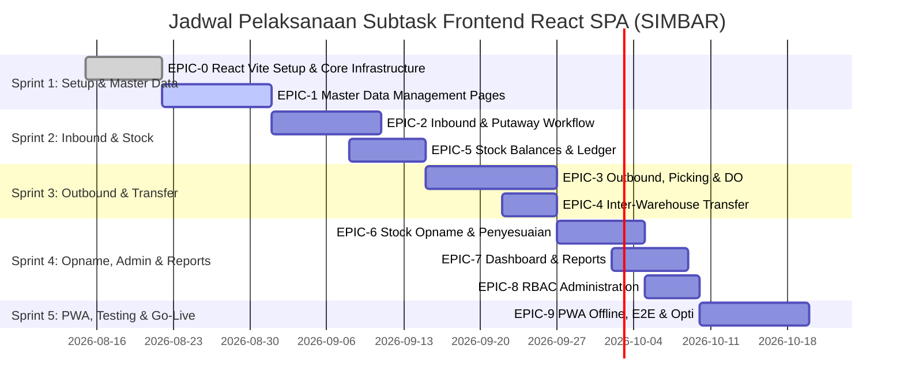

# Subtask Breakdown — Front End Engineer (SIMBAR - React SPA)

Dokumen ini berisi rincian *subtask* pekerjaan **Front End Engineer** untuk pembangunan aplikasi **SIMBAR (Sistem Manajemen Barang)** berbasis pada dokumen **PRD (Product Requirement Document)** dan **FSD (Functional Specification Document)** dengan menggunakan **React** sebagai stack Frontend utama.

---

## 🛠️ Stack & Standards Frontend (React Tech Stack)
- **Framework & Build Tool:** React 19 + Vite 6 + TypeScript (Strict Mode)
- **Routing:** React Router v7 (Data Router / Browser Router)
- **UI Component Library:** Ant Design 5 (Locale `id_ID`, custom theme token)
- **State Management:** Zustand (Auth session, active warehouse context, scanning basket, offline status)
- **Data Fetching & Caching:** TanStack Query v5 (React Query)
- **Form & Validation:** React Hook Form + Zod (Skema tervalidasi sesuai OpenAPI)
- **Scanner Integration:** `@zxing/browser` (Kamera HP/Tablet PWA) & Keyboard Wedge Listener (Scanner USB/Bluetooth)
- **PWA & Offline Draft:** `vite-plugin-pwa` (Workbox Service Worker) + IndexedDB (`dexie`) untuk draft transaksi & sinkronisasi otomatis
- **Visualization & Export:** Recharts (Dashboard/Analytics) & Printable HTML/CSS templates (Surat Jalan & Label Barcode)
- **Testing:** Vitest + React Testing Library (Unit/Component) & Playwright (E2E)

---

## 🗂️ Overview Matriks Subtask

| Epic ID | Nama Epic / Modul | Jumlah Subtask | Prioritas | Target Fase |
|---|---|---|---|---|
| **EPIC-0** | Infrastructure, Core Setup & PWA Architecture | 6 Subtasks | MUST | MVP (Fase 1) |
| **EPIC-1** | Master Data Management | 6 Subtasks | MUST / SHOULD | MVP (Fase 1) |
| **EPIC-2** | Inbound Management (Penerimaan Barang & Putaway) | 5 Subtasks | MUST | MVP (Fase 1) |
| **EPIC-3** | Outbound & Delivery Management (Pengeluaran, Picking & DO) | 7 Subtasks | MUST / SHOULD | MVP (Fase 1 & 2) |
| **EPIC-4** | Inter-Warehouse Transfer (Mutasi Antar Gudang) | 3 Subtasks | MUST | MVP & Fase 2 |
| **EPIC-5** | Stock Balances, Stock Card & Auditing | 4 Subtasks | MUST | MVP (Fase 1) |
| **EPIC-6** | Stock Opname & Penyesuaian (Stock Counting & Adjustment) | 5 Subtasks | MUST | MVP (Fase 1) |
| **EPIC-7** | Dashboard, Planning & Reports | 5 Subtasks | MUST / SHOULD | MVP & Fase 2 |
| **EPIC-8** | User Access Control & RBAC Administration | 3 Subtasks | MUST | MVP (Fase 1) |
| **EPIC-9** | PWA Offline Sync, Testing & Optimization | 4 Subtasks | MUST | MVP (Fase 1) |

---

## 📋 Detail Subtask per Epic

---

### 🚀 EPIC-0: Infrastructure, Core Setup & PWA Architecture

> **Deskripsi:** Menyiapkan fondasi proyek React (Vite SPA), sistem routing React Router v7, sistem autentikasi JWT + RBAC, manajemen state global, HTTP interceptor, integrasi PWA, serta sistem layout UI responsif.

#### `FE-001`: Inisialisasi Proyek React 19 + Vite 6, Ant Design 5 & Layout System
- **Ref FSD:** §2.2, §7.1 | **Prioritas:** MUST (MVP)
- **Tugas:**
  - Inisialisasi proyek React 19 menggunakan Vite 6 dengan template TypeScript (`npm create vite@latest ./ -- --template react-ts`).
  - Integrasi Ant Design 5 dengan `ConfigProvider` untuk kustomisasi tema (Warna primer corporate, radius, font Inter/Outfit, locale `id_ID`).
  - Buat struktur direktori terorganisir: `src/api`, `src/components`, `src/hooks`, `src/layouts`, `src/pages`, `src/routes`, `src/store`, `src/types`, `src/utils`.
  - Buat komponen Layout Utama (`AppLayout`): `SidebarMenu` (collapsible), `HeaderBar` (profil user, notifikasi, selector Gudang Aktif), `Breadcrumb`, dan `Outlet` React Router.
- **Kriteria Penerimaan (AC):**
  - Proyek React SPA dapat di-build dan dijalankan dengan Vite Dev Server tanpa error.
  - Komponen Ant Design ter-render rapi dalam Bahasa Indonesia.
  - Sidebar menu responsif pada layar desktop dan mobile.

#### `FE-002`: Setup Client API, Axios/Fetch Interceptor & Management Error Standard
- **Ref FSD:** §5.1, §5.4, §7.2 | **Prioritas:** MUST (MVP)
- **Tugas:**
  - Inisialisasi API Client terstruktur berbasis OpenAPI specification (`oapi-codegen` / OpenAPI Fetch / Axios instance).
  - Buat interceptor request untuk menyisipkan header wajib: `Authorization: Bearer <token>`, `X-Request-Id` (UUID v4), `X-Warehouse-Id` (Gudang aktif dari store), dan `Idempotency-Key` pada metode `POST`/`PUT`.
  - Buat interceptor response untuk penanganan error terpusat (`ERR_STOCK_INSUFFICIENT`, `ERR_SCAN_MISMATCH`, `ERR_SELF_APPROVAL`, `ERR_UNAUTHENTICATED`).
  - Buat mapper error API ke pesan pemberitahuan Ant Design (`notification` / `message`) dalam Bahasa Indonesia.
- **Kriteria Penerimaan (AC):**
  - Semua request outbound otomatis membawa token auth dan header `X-Warehouse-Id`.
  - Jika token kedaluwarsa (401), sistem otomatis memicu rotasi token via `/auth/refresh` atau redirect ke rute `/login`.
  - Error 422 / 409 menampilkan pesan error yang mudah dipahami staf gudang.

#### `FE-003`: Setup React Router v7, Zustand Store State & Protected Guard Routes
- **Ref FSD:** §5.2, §6, §7.1 | **Prioritas:** MUST (MVP)
- **Tugas:**
  - Buat konfigurasi rute terpusat dengan React Router v7 (`createBrowserRouter`).
  - Buat Zustand store `useAuthStore` (token JWT, user info, roles, permissions).
  - Buat Zustand store `useWarehouseStore` (daftar gudang yang diakses, gudang aktif saat ini).
  - Implementasikan halaman Login (`/login`) dengan form autentikasi React Hook Form + Zod, penanganan 2FA/TOTP jika role admin/manager.
  - Buat Guard Component (`ProtectedRoute`, `PermissionGuard`) menggunakan `<Navigate />` dan `<Outlet />` untuk membatasi akses rute sesuai RBAC (Casbin permission).
- **Kriteria Penerimaan (AC):**
  - User dapat login dan menyimpan JWT access token (15 mnt) + refresh token (7 hari) di secure store.
  - Staf hanya dapat membuka rute dan tombol aksi yang sesuai dengan role dan gudang yang ditugaskan kepadanya.
  - Pemilihan gudang di header langsung memperbarui state `X-Warehouse-Id` global.

#### `FE-004`: TanStack Query v5 Setup & Custom Hooks Utility
- **Ref FSD:** §7.2 | **Prioritas:** MUST (MVP)
- **Tugas:**
  - Setup `QueryClientProvider` React Query dengan default config: `staleTime: 30_000` (master data), `staleTime: 0` (saldo stok & dokumen), `refetchOnWindowFocus: false`.
  - Buat custom hooks reusabel untuk data fetching: `usePaginatedQuery`, `useDebouncedSearch`, `useMutationWithToast`.
  - Implementasi invalidasi query otomatis saat mutasi data berhasil (`queryClient.invalidateQueries`).
- **Kriteria Penerimaan (AC):**
  - Caching data master berfungsi efisien tanpa request berulang berlebihan.
  - UI menampilkan indikator loading skeleton / spinner secara halus saat fetching data.

#### `FE-005`: Setup Custom Hook Barcode Scanner (Camera & USB Keyboard Wedge)
- **Ref FSD:** §2.2, §7.3 | **Prioritas:** MUST (MVP)
- **Tugas:**
  - Buat custom hook React `useScannerKeyboardWedge` untuk membaca input scanner USB/Bluetooth (deteksi rentetan keystroke cepat < 50ms diakhiri `Enter`).
  - Buat modal / komponen React `CameraScannerModal` menggunakan `@zxing/browser` untuk scan via kamera smartphone/tablet PWA.
  - Tambahkan feedback visual & suara/getar (Haptic Feedback `navigator.vibrate` & Audio Beep) saat hasil scan valid atau salah.
- **Kriteria Penerimaan (AC):**
  - Scanner USB dapat membaca barcode tanpa mengharuskan input field dalam keadaan ter-fokus (global event listener berbatas waktu).
  - Modal kamera PWA dapat menyalakan lampu kilat (flashlight toggle) dan mendeteksi barcode 1D/2D QR code dengan presisi.
  - Umpan balik suara/getar berbunyi *beep-sukses* saat scan cocok dan *beep-error* saat scan tidak sesuai.

#### `FE-006`: Setup IndexedDB (Dexie.js) & Offline Draft Storage Foundation
- **Ref FSD:** §2.2, §7.3 | **Prioritas:** MUST (MVP)
- **Tugas:**
  - Inisialisasi basis data lokal browser `simbar_offline_db` menggunakan Dexie.js.
  - Buat skema tabel lokal: `draft_receipts`, `draft_pickings`, `draft_counts`, `sync_queue`.
  - Buat hook React `useOfflineDraft` untuk menyimpan draft transaksi secara lokal secara otomatis saat koneksi terputus (`navigator.onLine === false`).
- **Kriteria Penerimaan (AC):**
  - Saat offline, data yang diinput pengguna tidak hilang dan tersimpan rapi di IndexedDB.
  - Indikator status koneksi ("Online" / "Offline — Mode Draft") muncul di bagian header aplikasi React.

---

### 📦 EPIC-1: Master Data Management

> **Deskripsi:** Pengelolaan Master Data Barang/SKU, Satuan & Konversi (UoM), Gudang & Lokasi Bin berhierarki, Mitra Bisnis, Impor Massal CSV/Excel, serta Pencetakan Label Barcode.

#### `FE-101`: Modul Master Barang (SKU List, Form CRUD & Detail)
- **Ref PRD:** FR-1.1 | **Ref FSD:** §3.2 (`master.items`), §5.2 (`/items`), §7.1 (`/master/items`) | **Prioritas:** MUST (MVP)
- **Tugas:**
  - Buat halaman daftar barang (`src/pages/master/ItemsPage.tsx`) dengan Ant Design Table, paginasi, pencarian full-text (`q`), dan filter (kategori, kelas ABC, status aktif).
  - Buat form pembuatan & edit SKU (`src/pages/master/ItemFormPage.tsx`) menggunakan React Hook Form + Zod:
    - Field: Kode SKU, Nama Barang, Kategori, Satuan Dasar (Base UoM), Minimum Stock, Maximum Stock, Safety Stock, Lead Time (hari), Kelas ABC, Flag `is_batch`, Flag `is_expiry`, Flag `is_serial`.
  - Tambahkan validasi kustom Zod: Jika `is_expiry = true` maka `is_batch` wajib `true` (sesuai constraint DB `chk_expiry_needs_batch`).
  - Implementasikan aksi Soft Delete (Nonaktifkan Barang - FR-1.5).
- **Kriteria Penerimaan (AC):**
  - Admin Master Data dapat melihat, mencari, menambah, dan mengedit SKU.
  - Validasi form mencegah input `max_qty < min_qty` atau `is_expiry` aktif tanpa `is_batch`.
  - Penonaktifan barang bertransaksi menggunakan status soft delete (bukan hapus permanen).

#### `FE-102`: Sub-Modul Multi Satuan & Konversi UoM (Item UoM Tab)
- **Ref PRD:** FR-1.1 | **Ref FSD:** §3.2 (`master.item_uoms`), BR-08 | **Prioritas:** MUST (MVP)
- **Tugas:**
  - Buat komponen tab/sub-form konversi UoM pada detail SKU.
  - Pengelolaan daftar satuan alternatif (misal: BOX, KARTON) terhadap satuan dasar (misal: PCS) beserta faktor konversinya (misal: 1 BOX = 24 PCS).
  - Input barcode khusus per satuan alternatif.
- **Kriteria Penerimaan (AC):**
  - Pengguna dapat menambah multiple UoM dengan faktor konversi > 0.
  - Barcode per UoM tervalidasi unik di seluruh sistem.

#### `FE-103`: Modul Master Gudang & Lokasi Bin Berhierarki
- **Ref PRD:** FR-1.2 | **Ref FSD:** §3.2 (`master.warehouses`, `master.locations`), §7.1 (`/master/locations`) | **Prioritas:** MUST (MVP)
- **Tugas:**
  - Buat halaman pengelola Master Gudang (`src/pages/master/WarehousesPage.tsx`): Kode, Nama, Alamat, Status.
  - Buat halaman pengelola Master Lokasi Bin (`src/pages/master/LocationsPage.tsx`):
    - Tampilan struktur hierarki: `Gudang -> Zona -> Rak -> Level -> Kode Bin` (misal: `A-01-03-B`).
    - Form Input Bin: Tipe lokasi (`staging`, `pick`, `bulk`, `quarantine`, `damaged`, `transit`), Urutan Picking (`pick_seq`), Kapasitas.
  - Tampilan visual status keterisian bin (persentase kapasitas terpakai).
- **Kriteria Penerimaan (AC):**
  - Pengguna dapat mengelola lokasi bin dan menentukan urutan jalur picking (`pick_seq`).
  - Kode lokasi bin unik per gudang.

#### `FE-104`: Modul Master Mitra (Pemasok, Penerima/Unit)
- **Ref PRD:** FR-1.3 | **Ref FSD:** §3.2 (`master.partners`), §7.1 (`/master/partners`) | **Prioritas:** MUST (MVP)
- **Tugas:**
  - Buat halaman Master Mitra (`src/pages/master/PartnersPage.tsx`): Kode Mitra, Tipe (`supplier`, `customer`, `internal_unit`), Nama Mitra, Alamat Lengkap, Nama Kontak, No. Telepon.
  - Filter berdasarkan tipe mitra dan status aktif.
- **Kriteria Penerimaan (AC):**
  - Admin dapat menambah dan mengubah data pemasok dan unit penerima internal.

#### `FE-105`: Modul Impor Massal Master Data (CSV/Excel Upload UI)
- **Ref PRD:** FR-1.4 | **Ref FSD:** §5.2 (`POST /items/import`) | **Prioritas:** MUST (MVP)
- **Tugas:**
  - Buat UI Modal Upload Impor Data Barang di halaman Master Barang.
  - Sediakan template file Excel/CSV yang dapat diunduh pengguna.
  - Komponen drag-and-drop file upload dengan validasi format file (`.xlsx`, `.csv`).
  - Tampilan progress bar pengolahan job impor async (`job_id`) dan tabel laporan baris data yang gagal diimpor (error log per baris).
- **Kriteria Penerimaan (AC):**
  - Pengguna dapat mengunggah file spreadsheet master data.
  - Jika ada kesalahan format/data ganda, UI menunjukkan baris mana yang gagal beserta alasannya.

#### `FE-106`: Modul Cetak Label Barcode / QR Thermal Printer
- **Ref PRD:** FR-1.6 | **Ref FSD:** §2.2, §7.4 | **Prioritas:** SHOULD (Fase 2)
- **Tugas:**
  - Buat modal preview & cetak label barcode untuk SKU dan Lokasi Bin.
  - Layout CSS `@media print` presisi tinggi untuk printer thermal (ukuran standar 50x30 mm).
  - Generator elemen Barcode 1D (Code128) atau 2D (QR Code) menggunakan pustaka React Barcode / QRCode canvas.
- **Kriteria Penerimaan (AC):**
  - Label dapat dicetak langsung ke printer thermal tanpa terpotong margins.
  - Hasil cetak barcode mudah terbaca oleh scanner USB/kamera HP.

---

### 📥 EPIC-2: Inbound Management (Penerimaan Barang & Putaway)

> **Deskripsi:** Proses penerimaan barang dari pemasok (GRN), pemeriksaan fisik & QC per baris, unggah dokumen pendukung, dan alur putaway ke lokasi bin berbasis saran lokasi sistem.

#### `FE-201`: Modul Daftar & Detail Dokumen Penerimaan Barang (GRN List & View)
- **Ref PRD:** FR-2.1 | **Ref FSD:** §3.2 (`doc.documents(GRN)`), §5.2 (`GET /receipts`), §7.1 (`/inbound/receipts`) | **Prioritas:** MUST (MVP)
- **Tugas:**
  - Buat halaman daftar dokumen GRN (`src/pages/inbound/ReceiptsPage.tsx`) dengan filter status (`draft`, `submitted`, `approved`, `in_progress`, `completed`, `cancelled`), rentang tanggal, dan pemasok.
  - Buat halaman detail GRN (`src/pages/inbound/ReceiptDetailPage.tsx`): Header dokumen, referensi PO, status stepper/badge, tabel rincian baris barang.
  - Tampilkan tombol aksi berbasis State Machine Dokumen: Submit, Approve, Reject, Cancel.
- **Kriteria Penerimaan (AC):**
  - Pengguna dapat melihat daftar dan status terkini seluruh dokumen GRN.
  - Dokumen `Completed` terkunci dan tidak memiliki tombol edit/hapus.

#### `FE-202`: Form Pembuatan & Edit Dokumen GRN (Inbound Entry)
- **Ref PRD:** FR-2.1, FR-2.2, FR-2.3 | **Ref FSD:** §5.2 (`POST /receipts`), §5.3 | **Prioritas:** MUST (MVP)
- **Tugas:**
  - Buat form pembuatan GRN baru (`src/pages/inbound/ReceiptFormPage.tsx`): Pilih Gudang, Pemasok, Tanggal, No. Ref PO.
  - Table Input Baris Dinamis (Dynamic Form Lines):
    - Auto-complete pencarian SKU/Barcode.
    - Input Qty Terima, Satuan (UoM).
    - Deteksi selisih terhadap PO (toleransi over/under receipt).
    - Input No. Batch, Tanggal Kedaluwarsa (wajib diisi jika SKU bertanda `is_expiry/is_batch`).
    - Pilihan Status QC per baris (`available`, `quarantine`, `damaged`).
- **Kriteria Penerimaan (AC):**
  - Form memvalidasi kewajiban nomor batch & tanggal kedaluwarsa sesuai atribut master barang.
  - Peringatan visual muncul jika qty diterima melebihi toleransi PO.

#### `FE-203`: Maker-Checker Safeguard & Flow Persetujuan GRN
- **Ref PRD:** BR-05 | **Ref FSD:** §3.2 (`chk_maker_checker`), §4.4 | **Prioritas:** MUST (MVP)
- **Tugas:**
  - Implementasikan pengecekan hak persetujuan pada UI React:
    - Jika `current_user.id === document.created_by`, tombol **Approve** otomatis di-disable / disembunyikan dengan tooltip penjelasan (*"Pembuat dokumen tidak boleh menyetujui dokumennya sendiri"*).
  - Modal konfirmasi persetujuan / penolakan (dengan input `reason_code` jika menolak).
- **Kriteria Penerimaan (AC):**
  - Aturan Maker-Checker (BR-05) ter-enforce secara visual di UI.
  - Penolakan dokumen mewajibkan pengisian alasan.

#### `FE-204`: Layar Putaway Desktop & Mobile Scanner Interface
- **Ref PRD:** FR-2.5 | **Ref FSD:** §5.2 (`/receipts/{id}/putaway`), §7.3 | **Prioritas:** MUST (MVP)
- **Tugas:**
  - Buat layar interaktif Putaway (`src/pages/inbound/PutawayPage.tsx`):
    - Pemanggilan API saran lokasi bin (`GET /receipts/{id}/putaway-suggestion`).
    - Tampilan lokasi saran sistem (misal: Bin `A-01-02-C`).
    - Workflow Scan: Pengguna melakukan scan barcode Bin tujuan -> Scan barcode Barang -> Masukkan Qty Putaway.
  - Komparasi real-time antara bin saran vs bin aktual hasil scan.
- **Kriteria Penerimaan (AC):**
  - Staf gudang dapat melakukan konfirmasi putaway dengan melakukan scan lokasi bin dan item.
  - Jika scan bin tidak sesuai saran, UI meminta konfirmasi pemindahan lokasi.

#### `FE-205`: Modul Unggah Lampiran & Foto Fisik Barang Inbound
- **Ref PRD:** FR-2.6 | **Ref FSD:** §2.1 (MinIO/S3) | **Prioritas:** SHOULD (Fase 2)
- **Tugas:**
  - Integrasi komponen upload foto pada dokumen GRN.
  - Fitur ambil foto langsung via kamera smartphone/tablet PWA (untuk bukti barang rusak / surat jalan pemasok).
  - Preview & galeri gambar lampiran pada detail dokumen.
- **Kriteria Penerimaan (AC):**
  - Staf gudang dapat memfoto kondisi fisik barang/surat jalan pemasok dan mengunggahnya ke dokumen GRN.

---

### 📤 EPIC-3: Outbound & Delivery Management (Pengeluaran, Picking & DO)

> **Deskripsi:** Pengajuan permintaan barang, alokasi FEFO/FIFO otomatis, layar mobile picking list terurut lokasi, packing & verifikasi scan, penerbitan Surat Jalan (DO), dan unggah Bukti Serah Terima (POD).

#### `FE-301`: Modul Pengajuan & Approval Permintaan Barang (Item Request)
- **Ref PRD:** FR-4.1 | **Ref FSD:** §5.2 (`/requests`), §7.1 (`/outbound/requests`) | **Prioritas:** MUST (MVP)
- **Tugas:**
  - Buat halaman daftar dan form pengajuan permintaan barang oleh unit/cabang (`src/pages/outbound/RequestsPage.tsx`).
  - Pemilihan SKU, Qty yang diminta, Tanggal Dibutuhkan, Unit Peminta.
  - Alur persetujuan oleh Supervisor / Inventory Manager.
- **Kriteria Penerimaan (AC):**
  - Peminta dapat mengajukan daftar kebutuhan barang dan memantau status persetujuan.

#### `FE-302`: Modul Delivery Order (DO) & Trigger Alokasi Stok FEFO/FIFO
- **Ref PRD:** FR-4.2, BR-03, BR-07 | **Ref FSD:** §4.2, §5.2 (`/deliveries/{id}/allocate`) | **Prioritas:** MUST (MVP)
- **Tugas:**
  - Buat halaman pengelola Delivery Order (`src/pages/outbound/DeliveriesPage.tsx` & `DeliveryDetailPage.tsx`).
  - Tombol aksi **"Jalankan Alokasi FEFO/FIFO"**:
    - Memanggil API alokasi stok.
    - Menampilkan hasil alokasi stok per batch & lokasi bin pada detail dokumen.
  - Fitur Manual Override Alokasi (khusus role dengan izin `outbound.override_allocation`) wajib mengisi modal `reason_code`.
- **Kriteria Penerimaan (AC):**
  - UI menampilkan alokasi detail batch mana saja yang ter-reserve (stok *available* berkurang, *on-hand* tetap sampai shipped).
  - Override FEFO memerlukan alur justifikasi alasan.

#### `FE-303`: Layar Mobile Scanner Picking List (Rute Terurut `pick_seq`)
- **Ref PRD:** FR-4.3, FR-4.4 | **Ref FSD:** §5.2 (`POST /deliveries/{id}/pick`), §7.3 | **Prioritas:** MUST (MVP)
- **Tugas:**
  - Buat layar khusus mobile scanner Picking (`src/pages/outbound/PickingScanPage.tsx`):
    - Tampilan daftar item terurut berdasarkan `pick_seq` (jalur jalan terpendek di gudang).
    - Mode Scan Interaktif:
      1. Tampilkan target lokasi bin (misal: `B-02-01-A`).
      2. Scan Barcode Lokasi Bin -> Validasi.
      3. Scan Barcode SKU / Batch -> Validasi.
      4. Input / Konfirmasi Qty Ambil.
    - Penanganan Error Mismatch: Jika barcode tidak cocok dengan alokasi, munculkan alert merah & getar (`ERR_SCAN_MISMATCH`).
- **Kriteria Penerimaan (AC):**
  - Picker dipandu melewati rute lokasi bin secara efisien berurutan.
  - Sistem memblokir eksekusi jika item/lokasi yang scanned tidak sesuai data alokasi.

#### `FE-304`: Modul Packing & Verifikasi Pengeluaran Barang
- **Ref PRD:** FR-4.5 | **Ref FSD:** §5.2 (`/deliveries/{id}/ship`) | **Prioritas:** MUST (MVP)
- **Tugas:**
  - Halaman verifikasi akhir sebelum barang dimuat ke armada (Tab Packing pada `DeliveryDetailPage.tsx`).
  - Rekonsiliasi item yang telah dipick vs yang disiapkan.
  - Form detail pengiriman: Nama Ekspedisi/Driver, Plat Nomor Kendaraan, Catatan Pengiriman.
- **Kriteria Penerimaan (AC):**
  - Tombol **Posting Pengeluaran / Ship** hanya aktif setelah seluruh baris barang lolos verifikasi picking 100%.

#### `FE-305`: Template & Fitur Cetak Surat Jalan (Delivery Order PDF 3-Rangkap)
- **Ref PRD:** FR-4.5 | **Ref FSD:** §2.2, §7.4 | **Prioritas:** MUST (MVP)
- **Tugas:**
  - Buat komponen layout cetak Surat Jalan (Delivery Order / DO) standar A4 / A5 (3-ply: Lembar Penerima, Lembar Pengirim, Lembar Arsip).
  - Menampilkan: Nomor DO Unik, Tanggal, Pengirim (Gudang), Tujuan, Daftar Item (SKU, Nama, Qty, UoM, No. Batch), Kolom Tanda Tangan (Pengirim, Driver, Penerima).
  - Integrasi fitur cetak browser langsung (`window.print()`) / download PDF.
- **Kriteria Penerimaan (AC):**
  - Layout dokumen rapi, formal, dan siap cetak pada printer kantor/dot-matrix.

#### `FE-306`: Modul Upload Bukti Serah Terima (POD - Proof of Delivery) Digital
- **Ref PRD:** FR-4.6 | **Ref FSD:** §3.2 (`doc.deliveries`), §5.2 (`POST /deliveries/{id}/pod`) | **Prioritas:** MUST (MVP)
- **Tugas:**
  - Buat UI pengunggahan POD (`src/pages/outbound/PODUploadPage.tsx`):
    - Field Input: Nama Penerima Aktual, Waktu Diterima.
    - Komponen Canvas Tanda Tangan Digital (`react-signature-canvas`).
    - Upload Foto Bukti Serah Terima (foto dokumen ter-ttd / barang di lokasi penerima).
  - Pengubahan status dokumen menjadi `Completed`.
- **Kriteria Penerimaan (AC):**
  - Kurir/Staf dapat mengambil tanda tangan digital penerima langsung di layar sentuh HP/Tablet dan mengunggah foto penerimaan.

#### `FE-307`: Pengiriman Parsial & Tracker Outstanding Delivery
- **Ref PRD:** FR-4.7 | **Prioritas:** SHOULD (Fase 2)
- **Tugas:**
  - Tampilan penanganan status jika barang hanya terkirim sebagian (Partial Delivery).
  - Highlight baris sisa kuantitas yang masih outstanding.
- **Kriteria Penerimaan (AC):**
  - UI memisahkan item yang sudah selesai terkirim dan yang masih dalam antrean pengiriman ulang.

---

### 🔄 EPIC-4: Inter-Warehouse Transfer (Mutasi Antar Gudang)

> **Deskripsi:** Pengelolaan transfer barang antar gudang, pelacakan status barang dalam perjalanan (*In-Transit*), konfirmasi penerimaan di gudang tujuan, dan laporan selisih transit.

#### `FE-401`: Form & Daftar Transfer Out (Pengiriman Mutasi)
- **Ref PRD:** FR-5.1 | **Ref FSD:** §5.2 (`POST /transfers`), §7.1 (`/transfer`) | **Prioritas:** MUST (MVP)
- **Tugas:**
  - Buat halaman daftar dan form pembuat Dokumen Transfer Antar Gudang (`src/pages/transfer/TransfersPage.tsx`).
  - Input: Gudang Asal, Gudang Tujuan, Tanggal, Daftar SKU, Qty, Batch.
  - Aksi Pengiriman (Transfer Out): Mengubah status stok menjadi `in_transit` pada gudang asal.
- **Kriteria Penerimaan (AC):**
  - Pengguna gudang asal dapat memicu pengiriman mutasi barang.
  - Stok pada gudang asal berkurang dan berpindah status menjadi *In-Transit*.

#### `FE-402`: Modul Transfer In (Konfirmasi Penerimaan Gudang Tujuan)
- **Ref PRD:** FR-5.1 | **Ref FSD:** §5.2 (`POST /transfers/{id}/receive`) | **Prioritas:** MUST (MVP)
- **Tugas:**
  - Halaman konfirmasi penerimaan di gudang tujuan (`src/pages/transfer/TransferReceivePage.tsx`).
  - Fitur pemeriksaan barang masuk: Input Qty Diterima fisik vs Qty Dikirim.
  - Alokasi lokasi bin tujuan di gudang penerima.
- **Kriteria Penerimaan (AC):**
  - Staf gudang tujuan dapat mengonfirmasi kuantitas fisik mutasi yang diterima.

#### `FE-403`: Tampilan Laporan & Warning Selisih Transit
- **Ref PRD:** FR-5.2 | **Ref FSD:** §5.2 | **Prioritas:** MUST (Fase 2)
- **Tugas:**
  - UI visual indikator jika terdapat selisih antara Qty dikirim vs Qty diterima pada transaksi mutasi.
  - Form pengisian berita acara selisih transit.
- **Kriteria Penerimaan (AC):**
  - Selisih transit disahutkan secara eksplisit pada UI dokumen dan memicu alert penelusuran.

---

### 📊 EPIC-5: Stock Balances, Stock Card & Auditing

> **Deskripsi:** Tampilan real-time saldo stok per SKU/lokasi/batch, kartu stok append-only berpaginasi keyset, dan penelusuran jejak audit (Audit Log).

#### `FE-501`: Modul Tampilan Saldo Stok Real-Time (Stock Balance View)
- **Ref PRD:** FR-3.1, FR-3.2 | **Ref FSD:** §5.2 (`GET /stock/balances`), §7.1 (`/stock/balances`) | **Prioritas:** MUST (MVP)
- **Tugas:**
  - Buat halaman utama Saldo Stok (`src/pages/stock/StockBalancesPage.tsx`).
  - AntD Table interaktif: SKU, Nama Barang, Gudang, Lokasi Bin, No. Batch, Tgl Expiry, Status Stok (`available`, `quarantine`, `damaged`, `expired`, `in_transit`), Qty On-Hand, Qty Reserved, Qty Available.
  - Filter Kompleks & Search Bar Fast-Query: Filter Gudang, Kategori, Status, Expiry (misal: Kedaluwarsa < 30 hari), dan Pencarian SKU/Nama.
  - Highlight warna badge status (Merah: Expired/Damaged, Kuning: Quarantine, Hijau: Available).
- **Kriteria Penerimaan (AC):**
  - Pengguna dapat memantau posisi saldo stok fisik real-time hingga level bin & batch.
  - Query responsif dan mendukung pencarian cepat.

#### `FE-502`: Modul Kartu Stok Append-Only (Stock Ledger & Movement History)
- **Ref PRD:** FR-7.1, FR-7.2 | **Ref FSD:** §3.2 (`inv.stock_movements`), §5.2 (`GET /stock/movements`), §7.1 (`/stock/card/[itemId]`) | **Prioritas:** MUST (MVP)
- **Tugas:**
  - Buat halaman Kartu Stok Barang (`src/pages/stock/StockCardPage.tsx`).
  - Tampilan Ledger Pergerakan Stok: Tanggal & Waktu (WIB), Tipe Transaksi (`receipt`, `issue`, `transfer_out`, `transfer_in`, `adjustment`, dll), No. Dokumen (linkable ke detail dokumen), Lokasi Bin, Batch, Qty Masuk (+), Qty Keluar (-), Saldo Berjalan (`qty_after`), Petugas.
  - Implementasi **Keyset Cursor Pagination** (Next/Previous Page berbasis `moved_at` & `id`) + Filter Wajib Rentang Tanggal.
  - Penegakan UI Read-Only: Tidak ada tombol Edit/Hapus (Append-Only indicator banner).
- **Kriteria Penerimaan (AC):**
  - Kartu stok menampilkan riwayat kronologis pergerakan barang secara akurat.
  - Paginasi cursor berjalan lancar tanpa penurunan performa pada puluhan ribu baris transaksi.

#### `FE-503`: Modul Viewer Audit Log Sistem
- **Ref PRD:** FR-7.3 | **Ref FSD:** §3.2 (`aud.audit_logs`), §5.2 (`GET /audit-logs`), §7.1 (`/admin/audit-logs`) | **Prioritas:** MUST (MVP)
- **Tugas:**
  - Buat halaman Audit Log (`src/pages/admin/AuditLogsPage.tsx`).
  - Tabel catatan aktivitas: Waktu, User, Aksi (`CREATE`, `UPDATE`, `APPROVE`, `CANCEL`, `LOGIN`), Entitas, IP Address, Request ID.
  - Modal Side-by-Side JSON Diff Inspector: Membandingkan data sebelum (`old_value`) dan sesudah (`new_value`) untuk melihat perubahan detail.
- **Kriteria Penerimaan (AC):**
  - Auditor/Admin dapat menelusuri riwayat perubahan data master dan dokumen transaksi.

#### `FE-504`: Visualisator Penelusuran Batch (Forward & Backward Batch Traceability)
- **Ref PRD:** FR-7.4 | **Prioritas:** SHOULD (Fase 2)
- **Tugas:**
  - Buat antarmuka penelusuran batch (`src/pages/stock/BatchTracePage.tsx`):
    - Forward Trace: Dari No. Batch tertentu -> Daftar semua unit/pelanggan penerima barang.
    - Backward Trace: Dari No. Batch -> Asal-usul pemasok & dokumen GRN penerimaan.
- **Kriteria Penerimaan (AC):**
  - Pengguna dapat melacak alur distribusi suatu batch barang secara penuh dari penerimaan hingga pengeluaran.

---

### 📝 EPIC-6: Stock Opname & Penyesuaian (Stock Counting & Adjustment)

> **Deskripsi:** Sesi perhitungan fisik stok (Full, Zone, ABC Cycle Count), lembar hitung buta (*Blind Count*), perhitungan selisih otomatis, persetujuan berjenjang, dan pencatatan penyesuaian (*Adjustment*).

#### `FE-601`: Modul Pembukaan Sesi Stock Opname (Count Session Management)
- **Ref PRD:** FR-6.1 | **Ref FSD:** §5.2 (`POST /counts`), §7.1 (`/counting`) | **Prioritas:** MUST (MVP)
- **Tugas:**
  - Buat halaman daftar dan form pembukaan sesi Stock Opname (`src/pages/counting/CountingSessionsPage.tsx`).
  - Pilihan Cakupan Opname: Penuh (Full Warehouse), Per Zona/Rak tertentu, atau Cycle Count berbasis Kelas ABC (A: Bulanan, B: Triwulanan, C: Semesteran).
  - Pembentukan snapshot stok awal sistem secara otomatis.
- **Kriteria Penerimaan (AC):**
  - Supervisor dapat membuka sesi hitung fisik sesuai metode cakupan yang dipilih.

#### `FE-602`: Layar Executing Blind Count Mobile/Desktop Scanner
- **Ref PRD:** FR-6.2 | **Ref FSD:** §5.2 (`POST /counts/{id}/lines`), §7.3 | **Prioritas:** MUST (MVP)
- **Tugas:**
  - Buat layar eksekusi hitung fisik (`src/pages/counting/CountExecutePage.tsx`):
    - **Prinsip Blind Count:** Kolom `qty_system` **disembunyikan sepenuhnya** dari petugas penghitung di lapangan.
    - Workflow Hitung: Scan Barcode Bin -> Scan Barcode SKU/Batch -> Input Qty Hasil Hitung Fisik (`qty_counted`).
    - Simpan draft hasil hitung secara berkala ke local state/IndexedDB.
- **Kriteria Penerimaan (AC):**
  - Petugas di lapangan tidak dapat melihat jumlah stok versi sistem saat menginput hasil hitung fisik.
  - Input dapat dilakukan dengan cepat menggunakan alat scan barcode.

#### `FE-603`: Modul Rekonsiliasi, Selisih & Persetujuan Berjenjang Opname
- **Ref PRD:** FR-6.3, FR-6.4 | **Ref FSD:** §5.2 (`POST /counts/{id}/post`) | **Prioritas:** MUST (MVP)
- **Tugas:**
  - Buat layar review hasil opname (khusus Supervisor/Inventory Manager):
    - Menampilkan perbandingan: Qty Sistem vs Qty Fisik -> Variansi (`variance`).
    - Wajib memasukkan Alasan Selisih (`reason_code`: Selisih Opname, Rusak, Hilang, Expiry) per baris yang berselisih.
  - Penyesuaian Berjenjang: Highlight jika nilai selisih melebihi ambang batas wewenang persetujuan supervisor.
  - Tombol Posting Penyesuaian (menghasilkan entri pergerakan stok `ADJ`).
- **Kriteria Penerimaan (AC):**
  - Supervisor/Manager dapat meninjau selisih opname, menginput alasan, dan melakukan posting penyesuaian stok.

#### `FE-604`: Modul Penyesuaian Stok Manual (Manual Adjustment Form)
- **Ref PRD:** FR-6.5 | **Ref FSD:** §5.2 (`POST /adjustments`) | **Prioritas:** MUST (MVP)
- **Tugas:**
  - Buat form penyesuaian stok langsung (`src/pages/counting/AdjustmentFormPage.tsx`): Pilih Gudang, Bin, SKU, Batch, Qty Penyesuaian (+/-), Kode Alasan Wajib, dan Catatan.
  - Alur persetujuan sesuai threshold nilai.
- **Kriteria Penerimaan (AC):**
  - Penyesuaian stok di luar sesi opname wajib menyertakan kode alasan yang sah dan persetujuan.

#### `FE-605`: Dashboard & Laporan Akurasi Inventori (IRA - Inventory Record Accuracy)
- **Ref PRD:** FR-6.6, Metrik KPI | **Ref FSD:** §5.2 | **Prioritas:** SHOULD (Fase 2)
- **Tugas:**
  - Buat widget/laporan performa IRA (% Kecocokan Barang Fisik vs Sistem).
  - Grafik tren akurasi stok per zona dan per periode opname.
- **Kriteria Penerimaan (AC):**
  - Manajemen dapat melihat skor IRA (Target ≥ 98%) setelah sesi opname diselesaikan.

---

### 📈 EPIC-7: Dashboard, Planning & Reports

> **Deskripsi:** Dashboard operasional real-time, laporan mutasi stok, laporan aging/kedaluwarsa, perencanaan persediaan (Min/Max/ROP), serta fitur ekspor laporan ke Excel/CSV/PDF.

#### `FE-701`: Dashboard Operasional Inventori (Operational Dashboard Widgets)
- **Ref PRD:** FR-9.1 | **Ref FSD:** §5.2 (`GET /dashboard/summary`), §7.1 (`/dashboard`) | **Prioritas:** MUST (MVP)
- **Tugas:**
  - Buat halaman Dashboard Utama (`src/pages/dashboard/DashboardPage.tsx`):
    - Widget KPI Metric Cards: Total Nilai & Qty Stok, Transaksi Hari Ini (GRN / DO), Item di Bawah Stok Minimum, Item Mendekati Expiry (H-30/H-90), Dokumen Menunggu Persetujuan.
    - Quick Action Buttons: Buat GRN, Buat Permintaan, Scan Picking, Opname Baru.
    - Recharts Components: Grafik Tren Barang Masuk vs Keluar (7 hari terakhir), Pie Chart Distribusi Stok per Kategori.
- **Kriteria Penerimaan (AC):**
  - Dashboard menampilkan ringkasan status operasional gudang secara visual dan cepat (< 2 detik waktu muat).

#### `FE-702`: Modul Laporan Mutasi Stok Per Periode (Stock Movement Report)
- **Ref PRD:** FR-9.2 | **Ref FSD:** §5.2 (`GET /reports/stock-mutation`), §7.1 (`/reports/*`) | **Prioritas:** MUST (MVP)
- **Tugas:**
  - Buat halaman Laporan Mutasi Stok (`src/pages/reports/StockMutationReportPage.tsx`):
    - Filter: Periode Tanggal (Awal - Akhir), Gudang, Kategori SKU.
    - Tabel Mutasi: SKU, Nama Barang, Satuan, Saldo Awal, Total Masuk (+), Total Keluar (-), Total Penyesuaian (+/-), Saldo Akhir.
- **Kriteria Penerimaan (AC):**
  - Menampilkan perhitungan matematis saldo mutasi yang akurat per rentang waktu yang dipilih.

#### `FE-703`: Modul Laporan Aging & Kedaluwarsa Barang (Expiry & Aging Report)
- **Ref PRD:** FR-9.3 | **Ref FSD:** §5.2 (`GET /reports/expiry-aging`) | **Prioritas:** MUST (MVP)
- **Tugas:**
  - Buat halaman Laporan Kedaluwarsa & Umur Stok (`src/pages/reports/ExpiryAgingReportPage.tsx`):
    - Pengelompokan umur stok / kedaluwarsa (Bucket: > 90 hari, 60-90 hari, 30-60 hari, < 30 hari, Expired).
    - Highlighting item kritis mendekati expired.
- **Kriteria Penerimaan (AC):**
  - Staf gudang dapat mengidentifikasi batch barang yang harus segera dikeluarkan sesuai prinsip FEFO.

#### `FE-704`: Modul Perencanaan Persediaan & Usulan Reorder Point (ROP View)
- **Ref PRD:** FR-8.1, FR-8.2, FR-8.3 | **Ref FSD:** §4.6 | **Prioritas:** SHOULD (Fase 2)
- **Tugas:**
  - Buat halaman Perencanaan Stok & Reorder Point (`src/pages/planning/ReorderPage.tsx`):
    - Tampilan item dengan saldo di bawah ROP (`ROP = (Rata-rata pemakaian harian x Lead Time) + Safety Stock`).
    - Daftar Usulan Pembelian (Purchase Suggestion List).
- **Kriteria Penerimaan (AC):**
  - Sistem menampilkan rekomendasi barang yang harus dibeli kembali beserta jumlah kuantitas usulannya.

#### `FE-705`: Fitur Export Data Laporan (Excel, CSV, PDF Download Async)
- **Ref PRD:** FR-9.5 | **Ref FSD:** §5.2, §7.4 | **Prioritas:** MUST (MVP)
- **Tugas:**
  - Tambahkan tombol **Export** (Excel / CSV / PDF) pada seluruh halaman Laporan.
  - Penanganan Async Export Job: Pengiriman request ekspor ke backend -> Notifikasi link unduh file setelah file selesai dibuat oleh server.
- **Kriteria Penerimaan (AC):**
  - Pengguna dapat mengunduh berkas laporan dalam format Excel/CSV/PDF tanpa membuat UI browser membeku (*freezing*).

---

### 🔐 EPIC-8: User Access Control & RBAC Administration

> **Deskripsi:** Pengelolaan pengguna, hak akses berbasis peran (RBAC), penugasan gudang aktif, dan konfigurasi format penomoran dokumen.

#### `FE-801`: Modul Manajemen Pengguna & Penugasan Gudang (User Management UI)
- **Ref PRD:** FR-10.1, FR-10.2 | **Ref FSD:** §3.2 (`sec.users`, `sec.user_roles`), §5.2, §7.1 (`/admin/users`) | **Prioritas:** MUST (MVP)
- **Tugas:**
  - Buat halaman Kelola Pengguna (`src/pages/admin/UsersPage.tsx`): Username, Email, Nama Lengkap, Status Aktif, Role, Gudang yang Ditugaskan.
  - Form Tambah/Edit User & Reset Password.
  - Assign Role & Multi-Warehouse Mapping UI (Membatasi akses data user hanya pada gudang tertentu - FR-10.2).
- **Kriteria Penerimaan (AC):**
  - Admin Sistem dapat mengelola akun pengguna dan menentukan gudang mana saja yang boleh diakses oleh user tersebut.

#### `FE-802`: Modul Manajemen Peran & Izin Akses (Role & Permission Management UI)
- **Ref PRD:** FR-10.1 | **Ref FSD:** §3.2 (`sec.roles`, `sec.permissions`), §7.1 (`/admin/roles`) | **Prioritas:** MUST (MVP)
- **Tugas:**
  - Buat halaman Kelola Peran (`src/pages/admin/RolesPage.tsx`).
  - Matriks Permission Checkbox per Modul & Aksi (misal: `grn.create`, `grn.approve`, `do.allocate`, `do.ship`, `count.approve`, `report.read`).
- **Kriteria Penerimaan (AC):**
  - Admin dapat membuat peran baru dan mengatur izin modul secara terperinci (granular).

#### `FE-803`: Modul Konfigurasi Penomoran Dokumen (Document Numbering Config UI)
- **Ref PRD:** FR-10.3 | **Ref FSD:** §4.3 | **Prioritas:** MUST (MVP)
- **Tugas:**
  - Buat halaman Konfigurasi Penomoran Dokumen (`src/pages/admin/DocNumberingPage.tsx`):
    - Setting prefix per tipe dokumen (misal: `GRN`, `DO`, `TRF`, `ADJ`).
    - Setting reset periodik (Bulanan / Tahunan) & jumlah digit sequence (misal: 5 digit: `00001`).
- **Kriteria Penerimaan (AC):**
  - Format nomor dokumen yang dihasilkan sesuai dengan aturan penomoran organisasi.

---

### 📱 EPIC-9: PWA Offline Sync, Testing & Optimization

> **Deskripsi:** Pengujian aplikasi (Unit & E2E), mekanisme PWA offline sync via Workbox untuk staf gudang, serta optimasi performa tampilan React SPA.

#### `FE-901`: Implementasi PWA Service Worker (`vite-plugin-pwa`) & Offline Sync Queue
- **Ref PRD:** Kebutuhan Non-Fungsional (Ketahanan) | **Ref FSD:** §2.2, §7.3 | **Prioritas:** MUST (MVP)
- **Tugas:**
  - Konfigurasi `vite-plugin-pwa` dengan Workbox Service Worker untuk caching asset statis React SPA.
  - Implementasikan Background Sync Queue: Saat koneksi internet pulih, sisa draft transaksi di IndexedDB (`sync_queue`) otomatis dikirim ulang ke backend dengan mempertahankan header `Idempotency-Key` original.
  - Indikator Visual UI: Toast/Banner status proses sinkronisasi data offline.
- **Kriteria Penerimaan (AC):**
  - Staf gudang dapat menginput data saat koneksi terputus dan otomatis ter-synchronize tanpa duplikasi data ketika online kembali.

#### `FE-902`: Unit & Component Testing (Vitest + React Testing Library)
- **Ref FSD:** §10 | **Prioritas:** MUST (MVP)
- **Tugas:**
  - Buat unit test untuk utility functions: Konversi UoM, Format Tanggal/Angka `id-ID`, Generator `Idempotency-Key`, Parser Barcode.
  - Buat component test React untuk komponen kritis:
    - Form Input GRN & Validasi Zod.
    - Komponen Guard Route RBAC (`ProtectedRoute`).
    - Custom Hook Keyboard Wedge Scanner.
- **Kriteria Penerimaan (AC):**
  - Unit test lulus 100% dengan code coverage pada utility & form logic ≥ 80%.

#### `FE-903`: End-to-End (E2E) Testing Alur Utama Gudang (Playwright)
- **Ref FSD:** §10 | **Prioritas:** MUST (MVP)
- **Tugas:**
  - Buat skrip E2E Playwright untuk menguji alur operasional utama (*Happy Path*):
    1. Login User -> Pilih Gudang.
    2. Input Dokumen GRN -> Approve -> Putaway.
    3. Permintaan Barang -> DO -> FEFO Allocation -> Picking Scan -> Ship (Surat Jalan) -> POD.
    4. Cek Perubahan Saldo Stok & Kartu Stok.
  - Skenario Uji Gagal: Uji pembagian Maker-Checker, Uji stok tidak mencukupi (`ERR_STOCK_INSUFFICIENT`).
- **Kriteria Penerimaan (AC):**
  - Automated E2E test Playwright berhasil mengeksekusi alur dari penerimaan hingga pengeluaran barang tanpa error.

#### `FE-904`: Performa & UI Mobile Responsiveness Optimization
- **Ref PRD:** Kebutuhan Non-Fungsional (Kegunaan & Kinerja) | **Ref FSD:** §7.3, §7.4 | **Prioritas:** MUST (MVP)
- **Tugas:**
  - Memastikan seluruh layar scan & operasional gudang memiliki Touch Target Size ≥ 48px, kontras tinggi, dan ramah penggunaan smartphone 5-7" saat berdiri.
  - Implementasi Virtual Scrolling pada AntD Table untuk menangani data saldo & ledger hingga 10.000+ baris tanpa lag.
  - Audit performa Lighthouse (Target Performance & PWA Score ≥ 85).
- **Kriteria Penerimaan (AC):**
  - Tampilan layar mobile staf gudang sangat responsif dan tidak ada lag saat melakukan scroll tabel besar.

---

## 📌 Rekapitulasi Rencana Eksekusi Sprint / Milestone (React SPA)

---
*Dokumen ini diperbarui untuk menggunakan React 19 + Vite + React Router v7 sebagai tech-stack Front End utama.*
