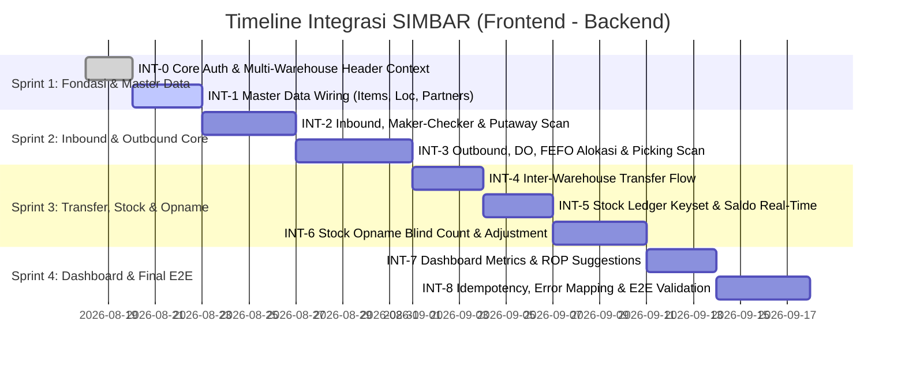

# Roadmap & Subtask Integrasi Sistem SIMBAR (Frontend – Backend)

Dokumen ini memetakan seluruh tugas integrasi antara **Frontend (React 19 + TypeScript + Ant Design 5 + Zustand + TanStack Query)** dan **Backend (Go Echo + PostgreSQL + pgx/sqlc + Redis/asynq + Casbin RBAC)** untuk aplikasi **SIMBAR (Sistem Manajemen Barang)** berdasarkan dokumen **PRD**, **FSD**, `sub-task.md` (Backend), dan `frontend/subtask.md` (Frontend).

---

## 🧭 Arsitektur & Kontrak Integrasi

```
+-------------------------------------------------------------------------------+
|                             REACT 19 SPA (FRONTEND)                           |
|  Zustand Stores | TanStack Query v5 | AntD 5 UI | React Hook Form + Zod       |
+---------------------------------------+---------------------------------------+
                                        |
                 HTTP REST (JSON Envelope, Snake_Case DTOs)
                 Headers: Authorization: Bearer <JWT>
                          X-Warehouse-Id: <WH_CODE>
                          X-Request-Id: <UUIDv4>
                          Idempotency-Key: <UUIDv4>
                                        |
+---------------------------------------v---------------------------------------+
|                            GO ECHO API (BACKEND)                              |
|  Casbin RBAC | Clean Architecture | PostgreSQL pgx/sqlc | Redis / Asynq Queue|
+-------------------------------------------------------------------------------+
```

### Format Amplop API Standar (FSD §5.1)
- **Sukses:**
  ```json
  {
    "success": true,
    "data": { ... },
    "meta": { "total": 100, "page": 1, "limit": 20 }
  }
  ```
- **Error:**
  ```json
  {
    "success": false,
    "data": null,
    "error": {
      "code": "ERR_STOCK_INSUFFICIENT",
      "message": "Saldo stok tidak mencukupi untuk alokasi.",
      "details": [],
      "request_id": "uuid-v4"
    }
  }
  ```

---

## 📊 Matriks Status Integrasi Modul

| Kode Epic | Modul / Alur Bisnis | Status Backend | Status Frontend | Status Integrasi | Prioritas |
|---|---|---|---|---|---|
| **INT-0** | Core Auth, Session & Multi-Warehouse Header Context | ✅ Selesai | ✅ Selesai | ✅ Terhubung Penuh | **MUST (P0)** |
| **INT-1** | Master Data (Items, UoM, Locations, Partners, Async Import) | ✅ Selesai | ✅ Selesai | ✅ Terhubung Penuh | **MUST (P0)** |
| **INT-2** | Inbound / GRN, Approval Maker-Checker & Putaway Scan | ✅ Selesai | ✅ Selesai | 🟡 Siap Wire Service | **MUST (P0)** |
| **INT-3** | Outbound, Permintaan, DO, Alokasi FEFO/FIFO & Picking Scan | ✅ Selesai | 🔄 Siap Integrasi | ⚪ Menunggu Wiring | **MUST (P0)** |
| **INT-4** | Mutasi Antar Gudang (Transfer Out In-Transit -> Transfer In) | ✅ Selesai | 🔄 Siap Integrasi | ⚪ Menunggu Wiring | **MUST (P1)** |
| **INT-5** | Stock Ledger Append-Only, Saldo Real-Time & Audit Trail | ✅ Selesai | 🔄 Siap Integrasi | ⚪ Menunggu Wiring | **MUST (P1)** |
| **INT-6** | Stock Opname (Blind Count) & Penyesuaian Stok (Adjustment) | ✅ Selesai | 🔄 Siap Integrasi | ⚪ Menunggu Wiring | **MUST (P1)** |
| **INT-7** | Dashboard Metrik, Background Job Alert & Usulan ROP | ✅ Selesai | 🔄 Siap Integrasi | ⚪ Menunggu Wiring | **SHOULD (P2)** |
| **INT-8** | Idempotensi, Offline Sync, Error Mapping & E2E Testing | 🔄 In Progress | 🔄 In Progress | ⚪ Verifikasi Menyeluruh | **MUST (P0)** |

---

## 📋 Rincian Subtask Integrasi

---

### 🔑 INT-0: Core Auth, Token Session & Context Multi-Gudang
> **Tujuan:** Menghubungkan alur otentikasi login, refresh token rotasi di Redis, dan propagasi header konteks gudang aktif pada seluruh request axios.

- [x] **`INT-001`**: Integrasi Halaman Login ke `POST /api/v1/auth/login`
  - **FE:** `src/pages/LoginPage.tsx` memanggil `authService.login({ username, password })`.
  - **BE:** `POST /api/v1/auth/login` memverifikasi hash Argon2id dan menerbitkan `access_token` (15m) + `refresh_token` (7d).
  - **Sinkronisasi State:** `setSession` mendekode payload JWT claims (`user_id`, `roles`, `warehouses`) dan menyimpan token di `localStorage`.

- [x] **`INT-002`**: Setup Interceptor Request Global (Headers Wajib)
  - **Headers:**
    - `Authorization: Bearer <token>`
    - `X-Request-Id`: Auto-generated UUID v4.
    - `X-Warehouse-Id`: Diambil langsung dari `useWarehouseStore.activeWarehouseCode` (misal: `WH01`).
    - `Idempotency-Key`: Auto-generated UUID v4 untuk request mutasi (`POST`, `PATCH`, `DELETE`).

- [x] **`INT-003`**: Integrasi Auto-Refresh Token Interceptor (`POST /api/v1/auth/refresh`)
  - **FE:** Menangani respon `401 Unauthorized` pada Axios interceptor:
    - Menahan request antrean (*request queue*).
    - Memanggil `authService.refresh(refreshToken)`.
    - Memperbarui token store dan mengulang request asli yang tertahan.
  - **BE:** Memvalidasi token rotasi di Redis dan mencabut token lama (*token revocation*).

---

### 📦 INT-1: Integrasi Modul Master Data (Items, Locations, Partners, Import)
> **Tujuan:** Menghubungkan UI CRUD Master Barang, Hirarki Lokasi Bin, Mitra Bisnis, dan Proses Asinkron Impor Massal CSV/Excel.

- [x] **`INT-101`**: Integrasi Master SKU & UoM (`/api/v1/items`)
  - **Daftar & Detail:** `itemService.listItems()` & `itemService.getItem(id)`.
  - **Form Tambah/Edit:** `itemService.createItem(payload)` & `itemService.updateItem(id, payload)`.
  - **Constraint:** Validasi `is_expiry = true` wajib menyertakan `is_batch = true` (`chk_expiry_needs_batch`).
  - **Soft Delete:** `itemService.softDeleteItem(id)` mengubah `is_active` menjadi `false`.

- [x] **`INT-102`**: Integrasi Master Gudang & Lokasi Bin (`/api/v1/locations`)
  - **FE:** `locationService.listLocations(warehouseId)` menampilkan hirarki `Gudang -> Zona -> Rak -> Level -> Bin` beserta atribut `pick_seq`, `loc_type`, dan kapasitas.
  - **BE:** Mengembalikan daftar lokasi bin tersaring berdasarkan parameter `warehouse_id`.

- [x] **`INT-103`**: Integrasi Master Mitra Pemasok & Unit (`/api/v1/partners`)
  - **FE:** `partnerService.listPartners()`, `getPartner(id)`, dan `createPartner(payload)`.
  - **BE:** Menyimpan data mitra (tipe `supplier`, `customer`, `internal_unit`) dengan enkripsi kontak sesuai UU PDP.

- [x] **`INT-104`**: Integrasi Asinkron Impor Massal SKU (`POST /api/v1/items/import`)
  - **FE:** `ItemImportModal.tsx` mengunggah berkas multipart (`.xlsx`, `.csv`) ke `POST /api/v1/items/import`.
  - **BE:** Menyimpan berkas, menjadwalkan job antrean Redis via `asynq`, dan merespons HTTP `202 Accepted` dengan `job_id`.
  - **FE:** Polling status job impor untuk menampilkan progress bar dan rincian baris data yang gagal divalidasi.


---

### 📥 INT-2: Integrasi Inbound, GRN, Maker-Checker & Putaway
> **Tujuan:** Menghubungkan seluruh siklus hidup penerimaan barang dari pemasok, penegakan Maker-Checker, hingga pemindahan stok ke lokasi bin penyimpanan.

- [x] **`INT-201`**: Integrasi Form Pembuatan Dokumen GRN (`POST /api/v1/receipts`)
  - **FE:** `ReceiptFormPage.tsx` mengirimkan data header dan baris barang (`po_reference`, `supplier_id`, `items`: `item_id`, `qty_expected`, `qty_received`, `batch_no`, `expiry_date`, `status`).
  - **BE:** Menghasilkan nomor dokumen otomatis berbasis generator sekuensial (misal: `GRN/WH01/2608/00001`) dan membuat draft transaksi.

- [ ] **`INT-202`**: Integrasi Pengajuan & Persetujuan GRN dengan Maker-Checker Guard
  - **Pengajuan:** `POST /api/v1/receipts/{id}/submit` mengubah status menjadi `submitted`.
  - **Persetujuan (Maker-Checker):** `POST /api/v1/receipts/{id}/approve`.
    - **Proteksi UI:** Tombol **Approve** dinonaktifkan jika `current_user.id === document.created_by`.
    - **Proteksi Backend:** Backend mengembalikan error `ERR_SELF_APPROVAL` (HTTP 422) jika pembuat mencoba menyetujui dokumen sendiri.
  - **Posting Stok Otomatis:** Persetujuan GRN memicu service posting stok masuk ke lokasi `staging`.

- [ ] **`INT-203`**: Integrasi Engine Saran Lokasi & Konfirmasi Putaway Scan
  - **Saran Lokasi:** `GET /api/v1/receipts/{id}/putaway-suggestion` mengembalikan rekomendasi bin tujuan berdasarkan kapasitas dan tipe barang.
  - **Eksekusi Putaway:** `POST /api/v1/receipts/{id}/putaway` memindahkan saldo stok dari lokasi `staging` ke lokasi `bin tujuan` hasil pemindaian scanner barcode.

---

### 📤 INT-3: Integrasi Outbound, Permintaan, DO, Alokasi FEFO/FIFO & Picking
> **Tujuan:** Mengintegrasikan pengajuan barang, pembuatan DO, engine alokasi otomatis FEFO/FIFO, panduan picking terurut `pick_seq`, posting pengiriman, dan bukti serah terima (POD).

- [ ] **`INT-301`**: Buat Service API Outbound Frontend (`src/api/services/outbound.ts`)
  - Menyediakan fungsi wrapper API:
    - `createRequest(data)` & `approveRequest(id)`
    - `createDelivery(data)` & `approveDelivery(id)`
    - `allocateDelivery(id)` & `overrideAllocation(id, data)`
    - `getPickingList(id)`
    - `confirmPick(id, data)`
    - `shipDelivery(id)`
    - `submitPOD(id, data)`

- [ ] **`INT-302`**: Integrasi Trigger Alokasi Stok FEFO/FIFO (`POST /api/v1/deliveries/{id}/allocate`)
  - **FE:** Tombol *"Jalankan Alokasi FEFO/FIFO"* pada `DeliveryDetailPage.tsx` memanggil endpoint alokasi.
  - **BE:** Menjalankan kueri alokasi FEFO (prioritas expiry terdekat) / FIFO dengan row-level lock `FOR UPDATE`, menambah `qty_reserved`, dan membuat baris `doc.allocations`.
  - **Error Handling:** Jika stok bebas kurang, server mengembalikan `ERR_STOCK_INSUFFICIENT` dengan detail kekurangan kuantitas.
  - **Override Flow:** Endpoint `/deliveries/{id}/allocate/override` menerima alokasi manual dengan kewajiban mengisi `reason_code`.

- [ ] **`INT-303`**: Integrasi Layar Mobile Picking Scanner Terurut Jalur (`pick_seq`)
  - **FE:** `PickingScanPage.tsx` mengambil picking list via `GET /api/v1/deliveries/{id}/picking-list` (diurutkan berdasarkan `pick_seq` lokasi bin).
  - **Eksekusi Scan:** Petugas memindai barcode Bin -> SKU -> Batch. Hasil scan dikirim ke `POST /api/v1/deliveries/{id}/pick`.
  - **Validasi Mismatch:** Jika scan tidak cocok dengan alokasi, backend merespons error `ERR_SCAN_MISMATCH` dan UI memunculkan visual alert + getar.

- [ ] **`INT-304`**: Integrasi Posting Pengiriman & Surat Jalan (`POST /api/v1/deliveries/{id}/ship`)
  - **Posting Stok Keluar:** Mengurangi `qty_onhand` dan `qty_reserved` serta mencatatkan baris ledger pengeluaran stok bernilai negatif di `inv.stock_movements`.
  - **Cetak Surat Jalan:** Menampilkan preview Surat Jalan (3-Rangkap) terisi nomor DO resmi dari backend.

- [ ] **`INT-305`**: Integrasi Unggah Bukti Serah Terima / POD (`POST /api/v1/deliveries/{id}/pod`)
  - **FE:** `PODUploadModal.tsx` mengirimkan nama penerima, waktu kedatangan, berkas tanda tangan digital (base64/canvas), dan foto bukti serah terima.
  - **BE:** Mengubah status dokumen DO menjadi `completed` secara final.

---

### 🔄 INT-4: Integrasi Mutasi Antar Gudang (Inter-Warehouse Transfer)
> **Tujuan:** Menghubungkan pengiriman mutasi stok antar gudang fisik dengan pelacakan status In-Transit.

- [ ] **`INT-401`**: Buat Service API Transfer Frontend (`src/api/services/transfers.ts`)
  - Wrapper API: `createTransfer`, `submitTransfer`, `approveTransfer`, `sendTransfer`, `receiveTransfer`.

- [ ] **`INT-402`**: Integrasi Alur Pengiriman Mutasi (`POST /api/v1/transfers/{id}/send`)
  - **FE:** `TransferFormPage.tsx` & `TransferDetailPage.tsx` memicu tombol *Kirim Barang*.
  - **BE:** Mengurangi stok `available` di gudang asal dan memindahkannya ke saldo status `in_transit` pada gudang tujuan.

- [ ] **`INT-403`**: Integrasi Konfirmasi Penerimaan Mutasi (`POST /api/v1/transfers/{id}/receive`)
  - **FE:** Gudang tujuan memverifikasi kuantitas fisik yang tiba dan memasukkan lokasi bin penempatan baru.
  - **BE:** Memposting mutasi saldo dari `in_transit` ke `available` pada lokasi bin gudang penerima.

---

### 📊 INT-5: Integrasi Kartu Stok, Saldo Real-Time & Audit Trail
> **Tujuan:** Menghubungkan tampilan posisi saldo stok multi-lokasi, kartu stok append-only berpaginasi keyset, dan penelusuran audit log.

- [ ] **`INT-501`**: Buat Service API Stok & Audit (`src/api/services/stock.ts` & `audit.ts`)
  - Wrapper API: `listStockBalances(params)`, `listStockMovements(params)`, `listAuditLogs(params)`.

- [ ] **`INT-502`**: Integrasi Kartu Stok Keyset Pagination (`GET /api/v1/stock/movements`)
  - **FE:** `StockCardPage.tsx` mengirimkan filter rentang tanggal (`date_from`, `date_to`) dan parameter cursor `(moved_at, id)`.
  - **BE:** Mengeksekusi kueri cepat pada partisi bulanan tabel `inv.stock_movements`.
  - **UI Safeguard:** Menegaskan mode Read-Only / Append-Only (tidak ada tombol edit/delete histori transaksi).

- [ ] **`INT-503`**: Integrasi Log Audit Sistem (`GET /api/v1/audit-logs`)
  - **FE:** `AuditLogsPage.tsx` menampilkan catatan aktivitas mutasi data dan membuka modal perbandingan JSON Diff (`old_value` vs `new_value`).

---

### 📝 INT-6: Integrasi Stock Opname & Penyesuaian Stok
> **Tujuan:** Menghubungkan pembukaan sesi opname dengan snapshot sistem otomatis, lembar hitung Blind Count, dan posting selisih berjenjang.

- [ ] **`INT-601`**: Buat Service API Counting & Adjustment (`src/api/services/counting.ts`)
  - Wrapper API: `createCountSession`, `inputCountLines`, `postCountAdjustment`, `createManualAdjustment`.

- [ ] **`INT-602`**: Integrasi Pembukaan Sesi Opname (`POST /api/v1/counts`)
  - **FE:** `CountingSessionsPage.tsx` memilih cakupan opname (Gudang Penuh, Zona/Rak, atau Siklus ABC).
  - **BE:** Mengambil snapshot kuantitas sistem saat itu juga dan menyimpannya di kolom `qty_system` pada `doc.count_lines`.

- [ ] **`INT-603`**: Integrasi Layar Blind Count Scanner (`POST /api/v1/counts/{id}/lines`)
  - **FE:** `CountExecutePage.tsx` menyembunyikan kolom `qty_system` dari pandangan petugas dan hanya menerima input hitung fisik `qty_counted`.
  - **BE:** Mengalkulasi selisih variansi secara otomatis di sisi server.

- [ ] **`INT-604`**: Integrasi Posting Penyesuaian & Manual Adjustment (`/counts/{id}/post` & `/adjustments`)
  - **FE:** Manager meninjau baris selisih, menginput kode alasan wajib (`reason_code`), dan menekan tombol *Posting Penyesuaian*.
  - **BE:** Memposting mutasi tipe `ADJ` ke ledger stok untuk menyelaraskan saldo sistem dengan hasil hitung fisik.

---

### 📈 INT-7: Integrasi Dashboard, Alert & Perencanaan Stok (ROP)
> **Tujuan:** Menghubungkan metrik widget dashboard, alert kedaluwarsa, dan rekomendasi pemesanan ulang stok.

- [ ] **`INT-701`**: Integrasi Widget Dashboard Ringkasan (`GET /api/v1/dashboard/summary`)
  - **FE:** `DashboardPage.tsx` menampilkan KPI metric cards: Total SKU aktif, Dokumen pending approval, Item di bawah ROP, Item mendekati kadaluwarsa (H-30/H-90).

- [ ] **`INT-702`**: Integrasi Usulan Reorder Point (`GET /api/v1/planning/reorder-suggestions`)
  - **FE:** Menampilkan tabel rekomendasi pembelian yang dihitung oleh background job `reorder.calc` backend (`ROP = (avg_daily_usage * lead_time) + safety_stock`).

---

### 🛡️ INT-8: Validasi Ketahanan, Idempotensi & Pengujian End-to-End
> **Tujuan:** Memastikan keandalan komunikasi antar-layanan melalui pengujian integrasi otomatis dan validasi skenario gagal.

- [ ] **`INT-801`**: Pengujian Idempotensi Transaksi (`Idempotency-Key`)
  - Simulasi pengiriman ganda request pembuatan dokumen dengan key yang sama -> Server mengembalikan respon asli (HTTP 200) tanpa duplikasi record di database.

- [ ] **`INT-802`**: Pengujian Menyeluruh Error Handling & Toast Notification
  - Memastikan seluruh kode error backend (`ERR_STOCK_INSUFFICIENT`, `ERR_SCAN_MISMATCH`, `ERR_SELF_APPROVAL`, `ERR_INVALID_STATE`) dipetakan secara akurat ke pesan notifikasi bahasa Indonesia yang ramah pengguna.

- [ ] **`INT-803`**: Uji Alur Penuh (End-to-End Integration Test di Docker Compose)
  - Menjalankan skenario operasional lengkap di lingkungan terintegrasi:
    1. Login Admin -> Set Gudang WH01.
    2. Master Item -> Buat SKU Ber-Expiry.
    3. GRN -> Input -> Submit -> Approve Maker-Checker -> Putaway Scan.
    4. Permintaan Barang -> DO -> Auto FEFO Allocate -> Picking Scan -> Ship -> POD.
    5. Cek Kartu Stok & Saldo Real-Time.

---

## 📅 Roadmap Pelaksanaan Integrasi



---
*Dokumen ini dibuat otomatis sebagai panduan resmi sinkronisasi dan integrasi end-to-end SIMBAR.*
